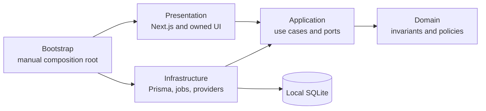

# Agent Auditor

**Behavioral security auditing for AI agents.**

_Audit agent behavior before real tools are connected._

Agent Auditor is a local-first application for examining how an AI agent's
instructions, declared tools, permissions, and operational controls shape its
behavior. It is being built as an engineering aid for developers and security
teams, not as a certification service or a guarantee that an agent is secure.

> **Current status:** the Hackathon MVP includes one complete, polished,
> deterministic Demo audit at `/audits/demo`. It runs without a database, API
> key, external service, or network request and produces a fixed evidence-backed
> report. The broader persisted engine remains an engineering foundation;
> ordinary queued runs still never fabricate results.

## Why Agent Auditor

Agent behavior is determined by more than a system prompt. Tool descriptions,
permission scope, untrusted inputs, confirmation rules, and failure handling
interact in ways that are difficult to review separately. Agent Auditor
provides a versioned, evidence-oriented foundation for testing those
interactions inside a side-effect-free simulation boundary.

The Hackathon journey exercises that product idea through one versioned
synthetic Support Desk fixture. The durable domain, persistence, and API
foundation remains available for the later user-defined audit pipeline.

## What works in the Hackathon MVP

- A landing-to-report Demo journey with bounded simulated progress.
- A deterministic 62/100 high-risk report with five category scores, eight
  tests, four evidence-backed findings, and four recommended guardrails.
- Reset and run-again actions that always reproduce the same report.
- A public judge path with no database read, mutation API, provider, API key,
  random value, or persistent storage dependency.
- A strict TypeScript, Next.js App Router application with an accessible local
  workspace shell.
- Agent profiles with immutable, fingerprinted revisions.
- Validated tool declarations, permission grants, and safe JSON Schema input.
- Prisma repositories backed by a local SQLite database and committed
  migrations.
- A persisted audit-run and job lifecycle with idempotent creation,
  cancellation, leasing, and interruption reconciliation foundations.
- Versioned HTTP contracts under `/api/v1` with safe error envelopes.
- Deterministic synthetic seed agents for local exploration.
- Demo and fake provider foundations that require no network or API key.
- Keyless lint, type, architecture, security, test, build, and CI foundations.

The public report is an explicitly labeled deterministic simulation fixture,
not the output of the unfinished persisted audit worker and not a security
certification. A normal queued run remains a truthful record of requested
future work.

## Demo runtime

| Mode | API key      | Current behavior                                                                                                                                |
| ---- | ------------ | ----------------------------------------------------------------------------------------------------------------------------------------------- |
| Demo | Not required | Runs the bundled deterministic fixture locally. No provider, external service, persistent database, real tool, or outbound request is involved. |

Do not add an API key for setup, development, CI, verification, or the public
demo. Provider-backed execution is outside this Hackathon MVP.

## Safety model

- Tool definitions are data, never executable integrations.
- User input cannot register code, commands, paths, modules, URLs, or network
  handlers for tool execution.
- Future target calls terminate in an application-owned closed simulator
  catalog containing only bounded synthetic behavior.
- Domain code is independent of React, Next.js, Prisma, Zod boundary schemas,
  and provider SDKs.
- Incoming HTTP, environment, database JSON, and provider-shaped data are
  treated as untrusted and validated at their boundaries.
- Logs use allow-listed structured metadata and redact common secret patterns;
  redaction is defense in depth, not perfect secret detection.
- Packaged Next.js commands explicitly disable framework telemetry; Agent
  Auditor adds no hosted telemetry of its own.
- Secrets remain server-side and are never intentionally returned by the
  configuration endpoint, persisted in SQLite, or written to logs.
- SQLite is local plaintext storage. Protect the database and its backups with
  appropriate filesystem controls and do not store real credentials in agent
  definitions.

See the [threat model](docs/security/THREAT_MODEL.md) for trust boundaries,
controls, and residual risks.

## Technology stack

- Node.js 24.18.0 and pnpm 11.14.0
- Next.js 16 with React 19 and the App Router
- strict TypeScript 6
- Zod for runtime boundary validation
- Prisma 7 with SQLite
- Tailwind CSS 4 and application-owned accessible components
- React Hook Form for structured agent-definition input
- Vitest, Testing Library, axe, and Playwright
- the official OpenAI JavaScript SDK behind an optional server-only port

Exact package versions are pinned in `package.json` and `pnpm-lock.yaml`.

## Architecture

Agent Auditor is a single-package modular monolith. The three bounded contexts
are Agent Catalog, Auditing, and Remediation. Each context follows a lightweight
Domain/Application/Infrastructure/Presentation separation.



Dependencies point inward. Module internals are private unless exposed through
an intentional module public API. Framework route handlers stay thin, and the
composition root selects concrete repositories and providers.

Read [Architecture](docs/ARCHITECTURE.md),
[Domain Model](docs/DOMAIN_MODEL.md), and the
[architecture decisions](docs/adr/) for detail.

## Documentation map

| Document                                       | Purpose                                                                     |
| ---------------------------------------------- | --------------------------------------------------------------------------- |
| [Project Plan](docs/PROJECT_PLAN.md)           | Product scope, milestones, risks, assumptions, and quality strategy         |
| [Architecture](docs/ARCHITECTURE.md)           | Boundaries, runtime flows, security model, engine and UI architecture       |
| [Roadmap](docs/ROADMAP.md)                     | Ordered milestone outcomes and exit criteria                                |
| [Domain Model](docs/DOMAIN_MODEL.md)           | Ubiquitous language, aggregates, invariants, lifecycles, and scoring policy |
| [Database Design](docs/DATABASE_DESIGN.md)     | Relational model, integrity, transactions, retention, and recovery          |
| [Technology Decisions](docs/TECH_DECISIONS.md) | Approved stack and engineering trade-offs                                   |
| [API Reference](docs/api/API_REFERENCE.md)     | Versioned routes, request protection, DTOs, and errors                      |
| [Threat Model](docs/security/THREAT_MODEL.md)  | Assets, trust boundaries, threats, controls, and residual risk              |
| [Development guides](docs/development/)        | Setup, testing, database changes, and release checks                        |

## Prerequisites

- Git
- Node.js 24.18.0 (the repository's `.node-version` is authoritative)
- Corepack, enabled for pnpm 11.14.0

SQLite is embedded; no separately running database or cloud service is needed.

## Quick start

```shell
corepack enable
pnpm install --frozen-lockfile
pnpm db:generate
pnpm dev
```

Open `http://127.0.0.1:3000` and select **Run Demo Audit**. No environment file,
database migration, seed, or API key is required for the judge journey. Apply
the database commands separately only when developing the persisted workspace.

For platform-specific notes and a clean setup walkthrough, see
[Development setup](docs/development/SETUP.md).

## Environment

Server configuration is parsed once and validated. The main settings are:

| Variable                     | Required | Purpose                                                                                                               |
| ---------------------------- | -------- | --------------------------------------------------------------------------------------------------------------------- |
| `NODE_ENV`                   | No       | Validated runtime environment (`development`, `test`, or `production`).                                               |
| `DATABASE_URL`               | No       | SQLite connection URL; defaults to `file:./prisma/dev.db`.                                                            |
| `APP_HOST` / `APP_PORT`      | No       | Validated local-origin metadata for protected mutation APIs. Development binds `127.0.0.1:3000`.                      |
| `LOG_LEVEL`                  | No       | Structured local log level.                                                                                           |
| `AUDIT_CONCURRENCY`          | No       | Bounded local job concurrency.                                                                                        |
| `AUDIT_MAX_TEST_CASES`       | No       | Maximum planned cases accepted by the foundation.                                                                     |
| `AUDIT_MAX_DURATION_SECONDS` | No       | Upper audit duration budget in seconds.                                                                               |
| `AUDIT_PROVIDER`             | No       | Preferred future provider (`demo` by default). Selecting `openai` does not enable Live audits in this phase.          |
| `PROVIDER_TIMEOUT_MS`        | No       | Future provider-call timeout.                                                                                         |
| `DEMO_SEED`                  | No       | Deterministic Demo seed.                                                                                              |
| `OPENAI_API_KEY`             | No       | Optional server-only Live configuration. Leave unset for this phase.                                                  |
| `OPENAI_MODEL`               | No       | Optional future Live model reference. It must be set together with the key and does not enable the unfinished engine. |

Never expose server settings through `NEXT_PUBLIC_` variables. The public
configuration endpoint returns only non-secret capability flags and limits.

## Database commands

```shell
pnpm db:generate          # generate the Prisma client
pnpm db:validate          # validate the Prisma schema
pnpm db:migrate           # create/apply a development migration
pnpm db:migrate:deploy    # apply committed migrations
pnpm db:seed              # load deterministic synthetic profiles
pnpm db:reset             # destructive: reset the configured development DB
pnpm db:studio            # inspect the configured development DB
```

Automated tests create isolated temporary databases and never use the normal
development database. Read [Database development](docs/development/DATABASE.md)
before resetting or editing migration history.

## Quality commands

```shell
pnpm format:check
pnpm lint
pnpm typecheck
pnpm test
pnpm test:unit
pnpm test:application
pnpm test:integration
pnpm test:contract
pnpm test:architecture
pnpm test:security
pnpm test:accessibility
pnpm test:e2e
pnpm test:coverage
pnpm build
pnpm verify
```

`pnpm verify` is the authoritative local quality gate and is keyless. Browser
tests also use Demo Mode and an isolated SQLite database. See
[Testing](docs/development/TESTING.md) for suite boundaries and prerequisites.

## Current routes

### Workspace

- `/`
- `/agents`
- `/agents/new`
- `/agents/[agentId]`
- `/audits`
- `/audits/[runId]`
- `/audits/demo` (database-independent Hackathon journey)

### HTTP API

- `GET /api/v1/health`
- `GET /api/v1/config`
- `GET|POST /api/v1/agents`
- `GET|DELETE /api/v1/agents/:agentId`
- `GET|POST /api/v1/agents/:agentId/revisions`
- `POST /api/v1/agents/:agentId/audits` (convenience alias)
- `GET /api/v1/revisions/:revisionId`
- `GET|POST /api/v1/audits`
- `GET /api/v1/audits/:runId`
- `POST /api/v1/audits/:runId/cancel`

See the [API reference](docs/api/API_REFERENCE.md) for validation, mutation
headers, status codes, and error envelopes.

## Current limitations

- The public Demo report is one immutable synthetic fixture, not a runtime
  assessment of user-defined agents.
- Audit jobs are persisted, but the complete user-defined execution engine and
  comparable verification workflow remain intentionally absent.
- Provider-backed execution is disabled; no automated check calls an external
  model API.
- All tools are declarations and future simulations; real external tools,
  remote agents, arbitrary plugins, browser automation, and dynamic code are
  outside the safety boundary.
- There is no authentication, user account, payment, cloud deployment, or
  multi-user isolation.
- SQLite is not encrypted by the application.

## Roadmap

The Hackathon MVP adds a complete deterministic judge slice over the M1/M2
foundation. The roadmap retains the larger user-defined execution, persistence,
and comparable verification milestones. See [Roadmap](docs/ROADMAP.md).

## Contributing and security

Contributions are welcome. Start with [CONTRIBUTING.md](CONTRIBUTING.md) and
follow [SECURITY.md](SECURITY.md) for private vulnerability reports. Public
behavior changes should include tests and documentation; architectural changes
may require an ADR.

This is a clean-room implementation. Project code, prompts, fixtures, audit
logic, scoring logic, and documentation are original to this repository except
for clearly attributed open-source standards and dependencies.

## License

Licensed under the [Apache License 2.0](LICENSE).

Copyright 2026 Jordi Garcia Castillon.
