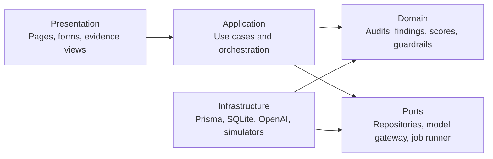

# Agent Auditor

**Behavioral security auditing for AI agents.**

Agent Auditor is a local-first application for examining how an AI agent's instructions, declared tools, and permissions shape its security behavior. It is designed to generate adaptive tests, preserve reviewable evidence, explain findings, recommend guardrails, and run a comparable verification audit after changes are applied.

> **Project status:** architecture and delivery planning are complete; application implementation has not started. This repository currently contains the product and engineering foundation requested for the planning phase.

## Why Agent Auditor

Agent behavior is determined by more than a system prompt. Tool descriptions, permission scope, untrusted inputs, confirmation rules, and failure handling all influence whether an agent behaves safely. Reviewing these elements separately makes important interactions easy to miss.

Agent Auditor will provide one workflow for:

- capturing a versioned agent definition;
- mapping the agent's behavioral attack surface;
- generating tests that adapt to its tools and permissions;
- executing those tests against side-effect-free tool simulators;
- collecting transcripts, decisions, and tool-call evidence;
- producing transparent findings and a versioned scorecard;
- proposing reviewable prompt, tool, and permission guardrails; and
- re-running a locked test plan to measure the effect of a revised definition.

It is intended for AI developers, AI startups, security teams, consultants, and AI governance teams. It is an engineering aid, not a certification or a substitute for expert review.

## Planned workflow

1. **Define the agent** — enter its system prompt, tool schemas, permission grants, and declarative Operational Controls.
2. **Review the surface** — inspect the normalized capabilities and validation warnings.
3. **Create an audit plan** — combine deterministic checks with capability-aware behavioral scenarios.
4. **Run safely** — let the target agent interact only with synthetic, in-process tool simulators.
5. **Inspect results** — review outcomes, findings, evidence, coverage, and dimension scores.
6. **Apply guardrails** — accept or edit proposed changes into a new immutable agent revision.
7. **Measure the effect** — execute the same locked plan and report paired improvement, no change, regression, or uncertainty.

## Operating modes

| Mode | API key | Intended use | Behavior |
| --- | --- | --- | --- |
| Demo | Not required | Evaluation, development, and offline demonstrations | Uses deterministic rules, capability-aware templates, seeded fixtures, and synthetic responses. It makes no outbound external runtime call; loopback UI traffic remains local. Results are clearly labeled as simulated. |
| Live GPT-5.6 | Required | Adaptive planning and behavioral execution | Uses the OpenAI API through a server-only adapter. Configuration is restricted to validated GPT-5.6 identifiers or snapshots, and the exact identifier will be confirmed during implementation. |

The API key will be read from a server-side environment variable, never sent to the browser, persisted in SQLite, or written to logs. Live mode will disclose that submitted audit content leaves the local process before a run begins.

## Architecture at a glance

Agent Auditor is planned as a strict TypeScript modular monolith. Each business module contains explicit Domain, Application, Infrastructure, and Presentation layers. Framework code remains at the edges; domain rules remain independent of React, Next.js, Prisma, and the OpenAI SDK.

The main bounded contexts are:

- **Agent Catalog** — agent profiles, immutable revisions, tools, and permissions;
- **Auditing** — plans, runs, executions, observations, evidence, findings, and scorecards; and
- **Remediation** — guardrail proposals, revised agent definitions, and baseline-to-verification comparisons.

See [Architecture](docs/ARCHITECTURE.md) and [Domain Model](docs/DOMAIN_MODEL.md) for the complete design.

## Security and privacy boundary

- Target tools are declarations, not executable integrations.
- Every tool result is synthetic and generated by a closed simulator registry.
- The audit engine will not use shell execution, dynamic code evaluation, arbitrary imports, or target-provided network locations.
- All inbound data and model-produced structures are size-limited and validated with Zod.
- Agent definitions and audit evidence remain local in Demo mode.
- Live mode sends only the data required for the selected audit step to the configured OpenAI model.
- The OpenAI API key and dedicated credential values are never persisted or logged. Agent revision text is stored verbatim in plaintext for audit fidelity; high-confidence credential formats are rejected and other secret-like text triggers a warning before save.
- Trace, evidence, error, and log redaction is defense in depth, not a guarantee that arbitrary secret text can always be detected.
- Audit plans, engine versions, target revisions, and evidence digests are retained so results remain explainable.

SQLite is not encrypted by default. The UI and documentation will make that local-storage limitation explicit and provide deletion controls before the MVP is considered complete.

## Documentation

| Document | Purpose |
| --- | --- |
| [Project Plan](docs/PROJECT_PLAN.md) | Scope, requirements, milestones, quality gates, risks, assumptions, and documentation plan |
| [Architecture](docs/ARCHITECTURE.md) | System structure, dependency rules, runtime flows, audit engine, UI architecture, and folder design |
| [Roadmap](docs/ROADMAP.md) | Ordered delivery milestones, exit criteria, dependencies, and post-MVP direction |
| [Domain Model](docs/DOMAIN_MODEL.md) | Ubiquitous language, aggregates, invariants, state machines, scoring, and comparison semantics |
| [Database Design](docs/DATABASE_DESIGN.md) | Conceptual Prisma/SQLite schema, relationships, constraints, indexes, transactions, and retention |
| [Technology Decisions](docs/TECH_DECISIONS.md) | Technology choices, alternatives, testing strategy, build pipeline, and unresolved validation items |

## Planned technology stack

- Node.js on the active long-term-support release
- Next.js with the App Router and React
- strict TypeScript
- Zod for runtime validation and boundary contracts
- Prisma ORM with SQLite
- the official OpenAI JavaScript SDK and Responses API for Live GPT-5.6 Mode
- Tailwind CSS with accessible, application-owned UI components
- Vitest, Testing Library, Playwright, and accessibility checks
- pnpm with an immutable lockfile

Exact dependency versions will be compatibility-checked and pinned when implementation begins. No dependencies or framework scaffolding are added during this planning phase.

## Delivery outline

The MVP is divided into seven implementation milestones: engineering foundation; domain and persistence; the target workflow with deterministic Demo Mode; evidence, findings, and scoring; guardrails and verification; Live GPT-5.6 Mode; and release hardening. Each milestone has testable exit criteria in the [Roadmap](docs/ROADMAP.md).

Authentication, payments, user accounts, notifications, cloud deployment, container orchestration, real tool execution, and enterprise infrastructure are explicitly outside the MVP.

## Contributing

Contributor guidance, security reporting instructions, architecture decision records, and a code of conduct are planned as part of release hardening. Until the implementation milestone begins, the design documents in `docs/` are the source of truth.

## License

Licensed under the [Apache License 2.0](LICENSE).

Copyright 2026 Jordi Garcia Castillón.
