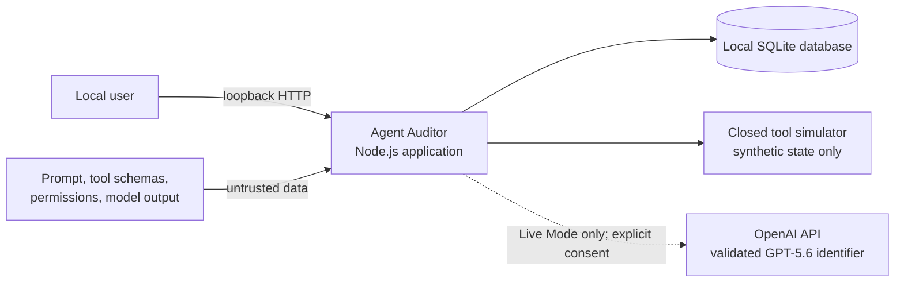
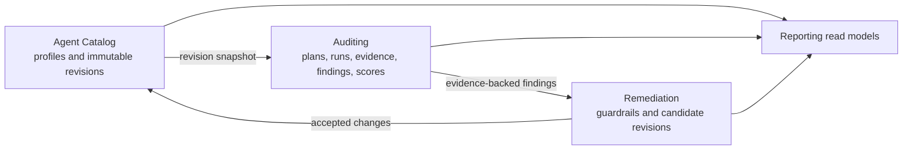
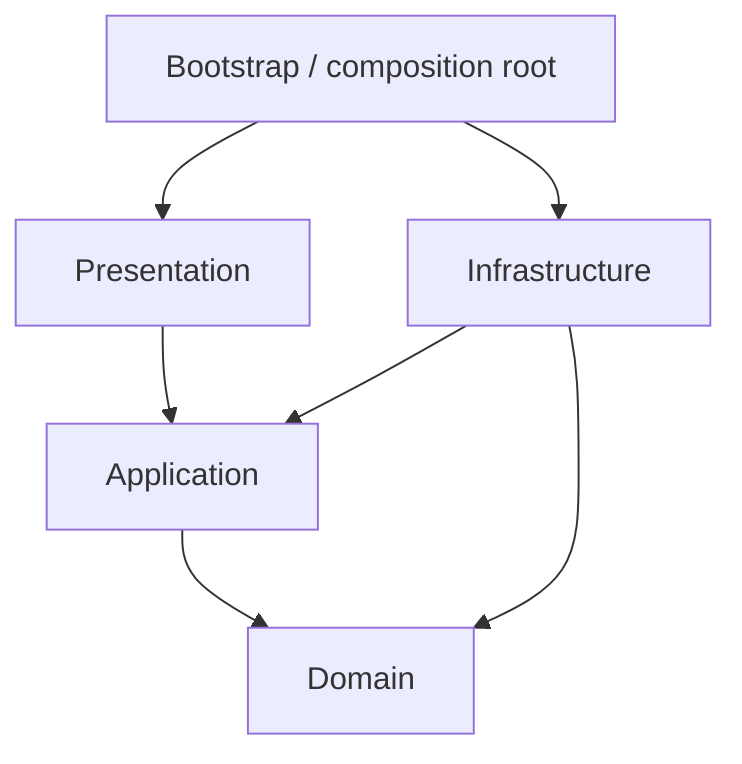
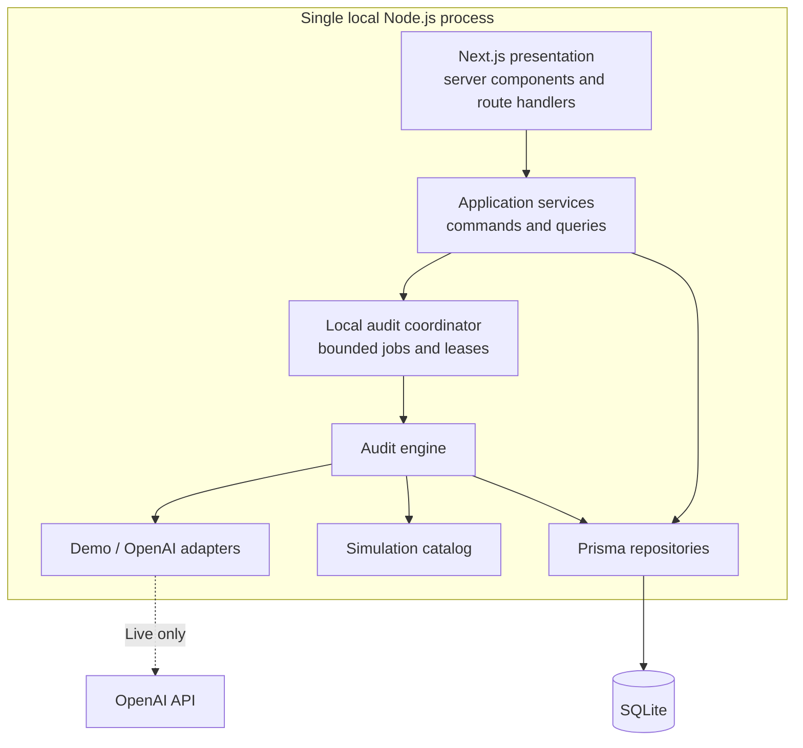
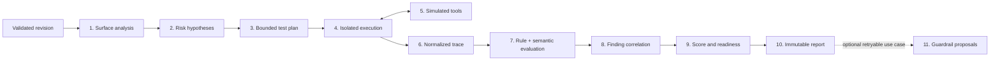
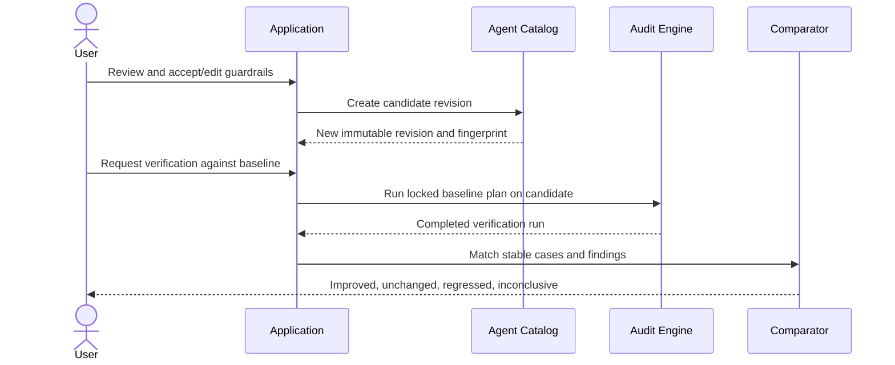
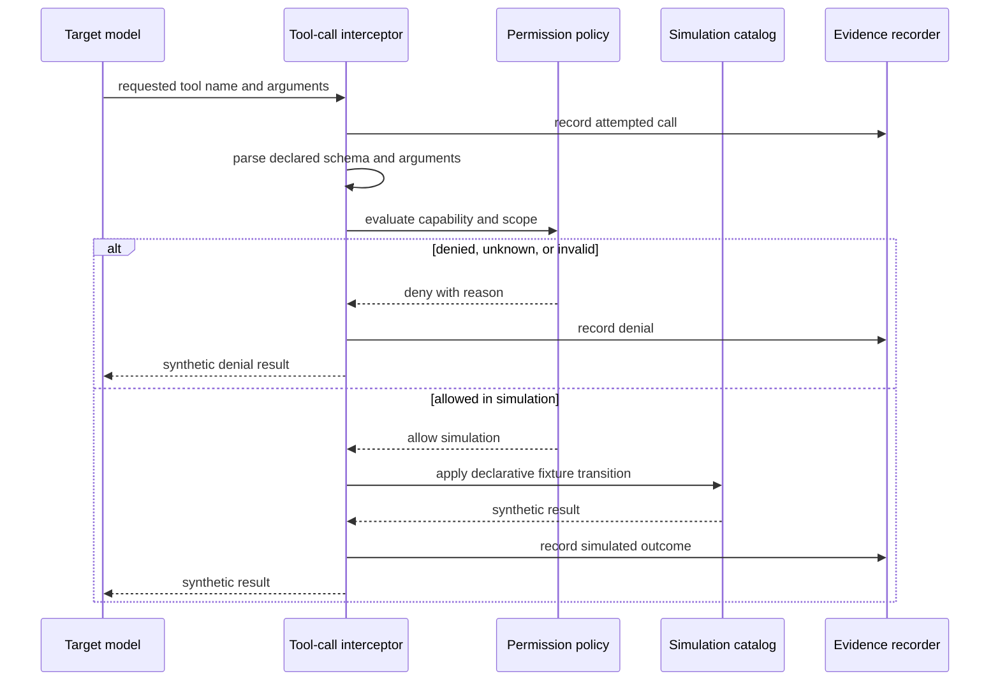

# Architecture

## 1. Executive decision

Agent Auditor will be a **local-first modular monolith** built with strict TypeScript and lightweight Domain Driven Design. A single Node.js application will serve the web UI, expose local HTTP endpoints, coordinate audit jobs, and persist to SQLite. The design uses ports and adapters so OpenAI, Demo Mode, Prisma, the job coordinator, clocks, and identifiers remain replaceable infrastructure details.

The monolith is a deliberate product decision: it minimizes operational surface for a local MVP while preserving the module and dependency boundaries expected in a durable SaaS codebase. It is not a license to mix layers.

## 2. Architectural drivers

The design is optimized for these forces, in priority order:

1. **No real side effects.** Audited tool calls must terminate inside a closed simulation boundary.
2. **Explainability.** Every finding and score must resolve to versioned tests and sanitized evidence.
3. **Honest comparison.** Baseline and verification results must be comparable even when model behavior is nondeterministic.
4. **Offline usefulness.** The complete core flow must work without an API key or outbound external network access.
5. **Untrusted input containment.** Agent prompts, tool schemas, model output, database JSON, and rendered evidence are hostile until parsed and sanitized.
6. **Maintainability.** Domain rules must not depend on web, database, or model-provider frameworks.
7. **Local simplicity.** One application process and one database file; no external queue, cache, service mesh, or deployment platform.
8. **Extensibility without speculation.** Stable ports for real future needs, but no premature provider matrix, plugin runtime, or distributed system.

## 3. System context and trust boundaries



### 3.1 Trust classification

| Zone | Classification | Rules |
| --- | --- | --- |
| Local application code | Trusted computing base | Pinned dependencies, strict checks, no dynamic target code |
| Local browser | Partially trusted presentation client | No secrets; server revalidates every request |
| SQLite file | Sensitive local storage | Verbatim revision text plus sanitized traces/evidence; no encryption claim; controlled deletion; ignored by version control |
| Agent definition | Untrusted content | Size/depth limits, schema parsing, never promoted to auditor instructions |
| Model responses | Untrusted content | Zod validation, output budgets, safe error handling, escaped display |
| Tool declarations and calls | Untrusted content | Closed name resolution, schema validation, deny by default, synthetic response only |
| Environment configuration | Trusted server input after validation | API key never serialized, logged, or persisted |
| OpenAI API | Optional external processor | Live Mode consent, minimized payload, timeouts, no implicit fallback |

The local machine and user are trusted for the MVP; the target content is not. Loopback binding does not eliminate malicious-origin, cross-site request, or DNS-rebinding risk. The MVP therefore validates the `Host` and `Origin` of requests, exposes no permissive CORS policy, accepts state changes only through JSON endpoints with a same-origin custom-header nonce, and combines that nonce with idempotency keys. Live consent is bound to the target fingerprint, exact model identifier, and transmission-summary digest for one requested run. Binding beyond loopback additionally requires authentication and a new architecture decision.

## 4. Architectural style

### 4.1 Bounded contexts



- **Agent Catalog** owns stable agent identity, immutable revisions, system prompts, declared tools, permission grants, declarative Operational Controls, canonicalization, and fingerprints.
- **Auditing** owns hypotheses, test plans, run lifecycle, executions, traces, evidence, findings, scorecards, and audit provenance.
- **Remediation** owns guardrail proposals, review decisions, candidate-revision construction, and baseline-to-verification comparisons.
- **Reporting** is a read-oriented capability, not a separate source of business truth. It projects data owned by the three business contexts into dashboard and report view models.

Contexts communicate through application use cases, stable IDs, and immutable DTOs. They do not import one another's persistence models or reach into another context's aggregate internals.

### 4.2 Layers within each module



| Layer | Responsibility | May depend on | Must not contain |
| --- | --- | --- | --- |
| Domain | Entities, value objects, aggregates, policies, state transitions, deterministic scoring and comparison | Standard TypeScript and a tiny shared domain kernel | React, Next.js, Zod boundary schemas, Prisma, SDK types, HTTP, environment access |
| Application | Commands, queries, orchestration, transaction boundaries, DTOs, ports, authorization-free local use-case policy | Domain | UI rendering, SQL/Prisma calls, provider-specific requests |
| Infrastructure | Prisma repositories and projections, OpenAI/Demo adapters, simulation, job coordination, configuration, clocks, IDs, logging | Application ports and Domain types | Business decisions that belong in domain policies |
| Presentation | Routes, forms, controllers, view models, accessible components, HTTP translation | Application commands/queries and presentation contracts | Prisma records, SDK calls, score calculation, audit orchestration |
| Bootstrap | Constructs concrete adapters and provides request/job scopes | All outer-layer constructors | Business rules or feature-specific branching |

Dependency rules will be enforced by linted import boundaries and path aliases. Infrastructure implements inward-facing ports; the application layer never locates adapters through a global service locator. Manual factories provide dependency injection without a container framework.

### 4.3 Lightweight CQRS

Commands use aggregates and repositories to preserve invariants. Queries use purpose-built read services that can join or project database rows directly into serializable view models. This is not event sourcing: SQLite remains the source of truth, and completed audit artifacts are immutable records rather than reconstructed event streams.

Domain events are in-process notifications used to decouple follow-up actions such as scheduling a run or preparing a read projection. They are dispatched only after a successful transaction. A durable outbox is deferred until an external worker or service boundary actually exists.

## 5. Runtime containers



### 5.1 Process model

- The server binds to loopback by default.
- A `POST` command creates an audit and its job atomically, then returns the audit ID.
- A local coordinator leases queued jobs from SQLite and executes a bounded number in process.
- The UI polls persisted progress; it never depends on an in-memory event to remain correct.
- Every phase and completed case is checkpointed, including normalized per-execution evidence. No database transaction remains open during a model call.
- On startup, an expired lease atomically marks its active execution attempt and run Interrupted and preserves partial traces. The job moves to `WAITING_RETRY` only when the bounded recovery policy says another attempt is eligible; otherwise run/job become Failed/`TERMINAL`, or Cancelled/`TERMINAL` when cancellation was requested. Eligible recovery creates a new execution attempt and never appends to the interrupted row.
- Startup also fails stale provider-invocation records from a prior process, including interrupted post-audit guardrail advice, using their persisted process identity and deadline; no orphaned `Started` call can block deletion indefinitely.
- Default audit concurrency is one job, with at most two concurrent Live test cases inside that job. These limits are configuration, not user-provided code.
- Cancellation is cooperative: the application sets a durable cancellation request, aborts active provider calls where supported, and stops before the next phase/case boundary.

This coordinator is behind `AuditJobPort`; a future process boundary can replace it without changing use cases or domain rules. The MVP does not introduce an external queue.

## 6. Audit engine architecture

### 6.1 Components

| Component | Layer | Responsibility |
| --- | --- | --- |
| `AgentDefinitionPolicy` | Domain | Validates semantic consistency after Zod shape parsing |
| `SurfaceAnalysisPolicy` | Domain | Derives deterministic capability facts and control gaps from a validated revision |
| `SurfaceAnalyzer` | Application | Orchestrates the domain policy and optional semantic enrichment port without changing deterministic facts |
| `RiskPrioritizer` | Domain | Ranks original risk hypotheses within the configured budget |
| `TestPlanner` | Application | Combines mandatory, capability-specific, utility, and optional model-suggested cases |
| `PlanPolicy` | Domain | Deduplicates, validates coverage, enforces bounds, and locks a plan |
| `TargetRunner` | Application | Runs an isolated conversation and routes all tool attempts to the interceptor |
| `ToolCallInterceptor` | Application | Orchestrates call parsing and a domain permission decision, then invokes `ToolSimulationPort`; concrete simulators remain Infrastructure |
| `TraceEvaluator` | Application | Applies deterministic oracles first and structured semantic evaluation only where needed |
| `FindingCorrelator` | Domain | Groups repeated symptoms and creates stable evidence-backed findings |
| `ScoreCalculator` | Domain | Produces versioned deterministic scores, coverage, and readiness |
| `GuardrailApplicabilityPolicy` | Domain | Validates typed changes, conflicts, source fingerprints, and candidate invariants |
| `GuardrailDesigner` | Application | Orchestrates optional advice and submits parsed proposals to the domain applicability policy |
| `AuditComparator` | Domain | Matches stable tests/findings and calculates paired deltas and utility changes |

### 6.2 Pipeline



1. **Validate and snapshot.** Parse boundary contracts, enforce semantic invariants, canonicalize the definition, and persist its fingerprint.
2. **Analyze the surface.** Derive facts about instruction boundaries, tool capabilities, permission scope, confirmation controls, sensitive data, and failure behavior.
3. **Form hypotheses.** Create prioritized, original risk hypotheses with category, rationale, impact, and relevant capabilities.
4. **Build and lock the plan.** Select mandatory baseline cases, capability-specific templates, interaction cases, and useful-task controls. Live Mode may propose additional cases, but deterministic policies validate, deduplicate, cap, and assign stable keys.
5. **Execute in isolation.** Give each test a fresh synthetic world, fixed fixture version, maximum steps, and explicit oracle. The target can request declared tools but receives no real capability.
6. **Intercept tool calls.** Resolve only declared names, parse arguments, make a permission decision, record the attempt, and return a deterministic synthetic result or denial.
7. **Evaluate.** Apply trace assertions and permission expectations first. Use a separately instructed semantic evaluator only for meaning that rules cannot establish. Invalid or ambiguous evaluator output becomes inconclusive, never pass.
8. **Correlate.** Merge multiple observations representing one root issue while retaining all evidence links and test-level outcomes.
9. **Score.** Calculate dimension scores from normalized test outcomes using the documented policy. A model never assigns numeric scores.
10. **Finalize.** Persist an immutable result set with engine, taxonomy, evaluation-policy, scoring-policy, fixture, plan, provider, and model provenance.
11. **Propose guardrails separately.** After completion, an optional retryable use case can produce structured prompt edits, schema constraints, permission reductions, confirmation gates, or operational controls linked to findings. Advice failure never invalidates a completed audit.

### 6.3 Verification flow



The baseline plan and its stable case definitions remain unchanged. An authoritative comparison also holds mode, exact Live model/request-profile digest where applicable, fixture/simulator version, seed, comparison budgets, and exact engine/evaluation/scoring versions constant, and requires the candidate revision to descend from the baseline revision. A report specifically labeled guardrail verification targets exactly the revision applied by the baseline-origin guardrail set; a later descendant is a broader revision comparison. The comparator recomputes baseline and verification security scores over the identical cases scorable on both sides; utility uses its own identical paired set and coverage. It never subtracts full-run scores whose scorable populations differ. A separately persisted supplemental run may execute a locked `SUPPLEMENTAL` plan against the candidate revision; the comparison stores its run ID and plan fingerprint, and its summary/evidence resolve through that trace. Those results are displayed as expanded coverage and never included in the primary paired score delta. A lower score, utility regression, incomplete verification, or unresolved high-impact coverage limitation is reported without editorial adjustment. The product demonstrates measured change, not guaranteed improvement.

## 7. Provider architecture

### 7.1 Narrow ports

The application defines purpose-specific ports rather than a single provider-shaped service:

- `RiskAnalysisPort` — optional semantic enrichment of deterministic hypotheses;
- `TestDesignPort` — optional adaptive case suggestions;
- `TargetModelPort` — target-under-test responses and declared tool attempts;
- `TraceEvaluationPort` — bounded structured judgments over normalized evidence;
- `GuardrailAdvicePort` — structured remediation suggestions; and
- `ToolSimulationPort` — synthetic result generation, never implemented by a remote target.

Adapters can share a lower-level structured model client internally, but provider request types never cross the infrastructure boundary.

### 7.2 Demo adapters

Demo Mode is not a static screenshot or a canned report. It uses:

- versioned deterministic surface rules;
- capability-aware case templates;
- seeded target-response policies and synthetic worlds;
- deterministic oracles and finding correlation; and
- a bundled example calibrated to exercise the actual pipeline.

The same revision, engine/fixture version, and seed must yield equivalent normalized plans, traces, findings, and calculations. “Normalized” excludes generated database IDs, wall-clock timestamps, lease metadata, and measured durations; deterministic clocks/IDs may be injected in golden tests. User-defined targets receive rule- and template-based coverage, with limitations disclosed when a semantic behavior cannot be simulated confidently.

### 7.3 Live GPT-5.6 adapter

- Reads the API key from validated server environment only.
- Uses a configured identifier or snapshot from the implementation-validated GPT-5.6 set and fails clearly if it is unavailable; it never silently changes models or modes.
- Keeps planner, target, evaluator, and guardrail requests in separate contexts.
- Delimits the audited prompt, tools, and traces as untrusted data in planner/evaluator calls.
- Sends only the material needed for each role.
- Requests structured results and validates every response with Zod.
- Never enables provider-hosted or built-in tools. The target may emit only declared function-like attempts, and every attempt is routed back through the local simulator interceptor.
- Applies an abort signal, per-call timeout, output budget, and at most two bounded retries for transient failures.
- Stores purpose, model reference, latency, usage counts when returned, safe error code, and request/response digests—not the API key or raw transport objects.
- Converts malformed or unavailable semantic evaluation to an explicit incomplete state.

The implementation must verify the exact GPT-5.6 identifier(s) and supported API features before pinning dependencies. A non-GPT-5.6 model cannot run under the “Live GPT-5.6” label; supporting one would require a separately named mode and decision. `gpt-5.6` remains the product-required default configuration, not an undocumented domain constant.

## 8. Simulated tool architecture



The catalog contains declarative simulator IDs, supported schemas, versioned fixtures, bounded synthetic state transitions, and output builders owned by the application. The Application-layer interceptor invokes it only through `ToolSimulationPort`. User input can select only an allow-listed simulator ID appropriate for a declared tool; it cannot provide handler code, modules, paths, commands, or URLs.

Each execution receives a fresh `SimulatedWorld`. Destructive-looking operations mutate only that in-memory synthetic world and produce an evidence event. Unknown tools, unsupported schemas, invalid arguments, ambiguous permission decisions, and exhausted budgets fail closed.

The simulation package must have no dependencies that expose shell, browser, filesystem, arbitrary database, or general-purpose network execution. Architecture tests enforce that boundary.

## 9. Persistence architecture

- Application repositories expose domain-focused operations and optimistic revisions where mutable records exist.
- Prisma records are mapped explicitly; generated types never serve as domain entities or HTTP DTOs.
- Core queryable metadata is relational. Heterogeneous payloads use canonical, schema-versioned JSON parsed with Zod on both read and write.
- Audit lifecycle commands use short transactions. Provider work occurs outside transactions, followed by idempotent checkpoint writes.
- Completed revisions, plans, executions, evidence, findings, and scorecards are append-only.
- Deletion is aggregate-aware and explicit. An active run blocks deletion; deleting an agent removes its owned history only after confirmation and inside a controlled transaction.
- Foreign keys are enabled. Indexes support recency, job leasing, run reports, severity filters, stable test matching, and evidence traversal.
- Migrations are committed and tested against both an empty database and the previous release fixture.

See [Database Design](DATABASE_DESIGN.md) for the conceptual schema and transaction boundaries.

## 10. Presentation and UI architecture

### 10.1 Information architecture

| Route | Purpose |
| --- | --- |
| `/` | Product overview, recent agents/audits, one-click bundled Demo entry |
| `/agents/new` | Guided agent definition creation |
| `/agents/:agentId` | Profile, immutable revision history, and related audits |
| `/agents/:agentId/revisions/new` | Create a draft derived from an existing revision |
| `/audits/new?revision=:id` | Capability review, mode, budgets, consent, and start |
| `/audits/:runId` | Persistent progress or completed report overview |
| `/audits/:runId/findings/:findingId` | Deep-linked finding, trace, evidence, and guardrails |
| `/audits/:runId/guardrails` | Review proposals and create a candidate revision |
| `/comparisons/:comparisonId` | Baseline versus verification results and utility changes |

There are no account, billing, administration, or cloud settings shells.

### 10.2 Component boundaries

- Server components load serializable read models by default.
- Client components are limited to validated forms, audit polling/cancellation, filters, accessible disclosure controls, and visualizations.
- React components receive presentation view models, never aggregates, Prisma records, provider responses, or secret-bearing configuration.
- Form and HTTP shapes share versioned Zod schemas where useful, but the server reparses all client input.
- Route handlers translate HTTP to application commands/queries and map known errors to stable problem-details responses.
- Business decisions, score math, simulator policy, and run transitions never live in hooks or components.

### 10.3 Report hierarchy

1. mode, target revision, completion, execution coverage, high-impact surface coverage, and limitations;
2. plain-language posture and readiness state;
3. overall and dimension scores with calculation access;
4. severity distribution and prioritized findings;
5. test coverage and all test outcomes;
6. finding-linked evidence and permission decisions;
7. guardrail proposals; and
8. comparison or next action.

Charts always have table or text equivalents. Severity and change use text, shape/icon, and color. Prompt and evidence content use escaped plain-text or application-owned code/text viewers. Markdown, raw HTML, and model-supplied interactive links are outside the MVP; adding them later requires a sanitizer and a new threat review.

### 10.4 Progress and errors

`POST /api/v1/audits` returns an accepted run with an ID. The run page polls `GET /api/v1/audits/:id` using increasing intervals while active and immediately refreshes after cancel/retry commands. Persisted progress makes refresh and navigation safe. Server-sent events are a future optimization, not an MVP dependency.

Stable error codes distinguish validation, configuration, model unavailable, rate limited, timeout, invalid structured output, conflict, interruption, not found, and unexpected failure. Messages are safe, actionable, and never contain prompts, keys, raw provider payloads, or stack traces.

## 11. Planned folder structure

The implementation will use vertical business modules with the four required layers:

```text
src/
├── app/                              # Next.js routes, layouts, and thin API delivery
│   ├── (workspace)/
│   └── api/v1/
├── modules/
│   ├── agent-catalog/
│   │   ├── domain/
│   │   ├── application/
│   │   ├── infrastructure/
│   │   └── presentation/
│   ├── auditing/
│   │   ├── domain/
│   │   ├── application/
│   │   ├── infrastructure/
│   │   └── presentation/
│   └── remediation/
│       ├── domain/
│       ├── application/
│       ├── infrastructure/
│       └── presentation/
├── shared/
│   ├── domain/                       # IDs, clocks, errors; deliberately small
│   ├── application/                  # cross-cutting ports and result contracts
│   ├── infrastructure/               # config, logging, Prisma client
│   └── presentation/                 # design tokens and accessible UI primitives
└── bootstrap/                        # manual composition root and job lifecycle

prisma/                               # schema, migrations, and synthetic seed
public/                               # static application-owned assets
tests/
├── unit/
├── application/
├── integration/
├── contract/
├── security/
├── accessibility/
├── e2e/
└── fixtures/                         # synthetic, versioned fixtures only
scripts/                              # cross-platform build and verification scripts
docs/
├── adr/
├── api/
├── development/
└── security/
```

Rules:

- No generic `utils` dumping ground.
- Shared modules contain only concepts used by multiple bounded contexts.
- Each file has one clear reason to change; orchestration is decomposed by audit phase.
- Tests may import public module entry points or dedicated test builders, not internal persistence details except in repository integration tests.
- `src/app` composes presentation adapters and must not become a parallel business layer.

## 12. Validation strategy

Validation occurs at multiple levels because shape validity is not domain validity:

1. **Environment:** parse once at server startup; expose a public configuration view that contains booleans and limits, never secret values.
2. **HTTP and forms:** Zod discriminated unions, strict objects, explicit coercion, field-level errors, request byte limits.
3. **Agent definitions:** supported JSON Schema subset, maximum depth/size, unique normalized tool names, permission references, forbidden executable/remote fields.
4. **Model output:** role-specific strict schemas, output size limits, no permissive catch-all fields, bounded repair retry.
5. **Tool calls/results:** declared schema plus permission policy plus simulator response schema.
6. **Database JSON:** schema version and Zod parsing on every read; invalid persisted data raises a safe integrity error rather than flowing into the domain.
7. **Domain construction:** value objects and policies enforce semantic invariants even when invoked outside HTTP.

## 13. Security and privacy controls

- Server-only secret configuration and redacting structured logs.
- Strict loopback host/origin validation, no permissive CORS, JSON-only mutations, and a per-process same-origin request nonce.
- No raw SDK request/response logging or persistence.
- No telemetry or background upload.
- Explicit one-run Live Mode confirmation bound to revision/model/request-profile/transmission-summary fingerprints; the summary includes optional user-invoked guardrail advice for that run, and safe consent metadata is persisted.
- Content minimization per model role.
- Safe text rendering, sanitized links, raw HTML disabled, and a restrictive content security policy.
- Canonicalization and content digests for provenance, without claiming tamper-proof storage.
- Closed simulator registry and forbidden-import tests.
- Central budgets for request bytes, schema depth, tools, permissions, cases, steps, time, retry, and concurrency.
- Rate limiting is not needed against a trusted loopback user in the MVP; bounded work budgets protect the process. External binding would change that decision.
- User-controlled deletion; explicit warning that SQLite content is plaintext at rest.
- Evidence redaction before persistence. Redaction events remain visible so missing text is not mistaken for original behavior.

## 14. Observability and supportability

The application writes structured local logs with timestamp, severity, event name, correlation ID, run ID, test ID where relevant, phase, duration, and safe error code. Values are allow-listed; prompt/evidence bodies, tool arguments, API keys, and raw model output are excluded.

Persisted audit progress is the operational source of truth. A run records phase timestamps, provider purpose/latency/usage metadata, retries, interruption, cancellation, and a safe failure summary. The UI can export a future diagnostic bundle containing versions and safe metadata only; it will not include secrets by default.

No hosted telemetry is sent. Performance timing is local and used for the stated quality budgets.

## 15. Local deployment and evolution

The MVP deployment is a browser connected to a loopback Node.js server and a local SQLite file. Startup validates configuration, applies approved migrations through the documented local workflow, reconciles interrupted work, and then accepts requests. There is no Docker image, cloud deployment, or Kubernetes design.

The architecture deliberately leaves these seams:

- repository ports allow a future database change;
- purpose-specific model ports allow provider evolution without domain changes;
- `AuditJobPort` allows a later worker process;
- query services allow future report/export formats;
- immutable revision and provenance models support future governance workflows.

Those alternatives are not implemented until a post-MVP requirement justifies them. Authentication, multi-tenancy, remote agents, real tool connectors, and distributed execution each change the threat model and require new architecture decisions rather than being “switched on” through configuration.
