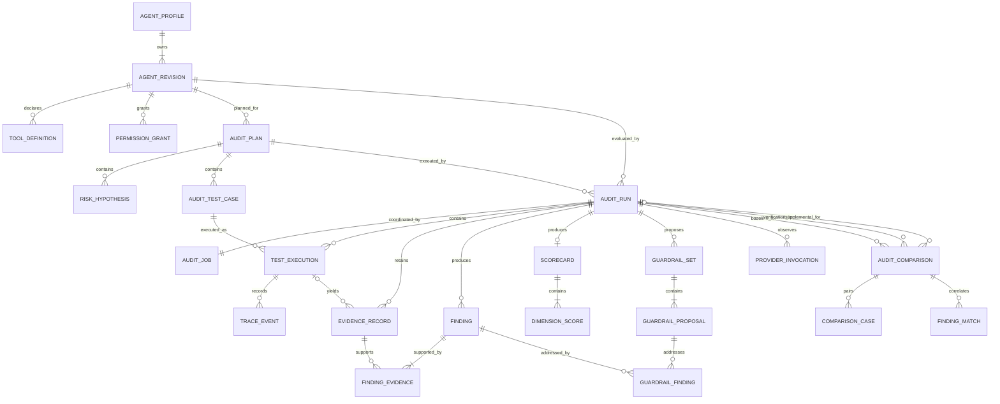

# Database Design

## 1. Purpose and constraints

Agent Auditor will use Prisma with SQLite as the local system of record. The schema must support immutable audit provenance, stage-level recovery, evidence traversal, paired comparisons, and future migration without introducing user, tenant, authentication, billing, or cloud-infrastructure concepts.

This is a **conceptual design**, not a Prisma schema. No Prisma files, migrations, generated client, or database are created during the planning phase.

### 1.1 Design principles

- Normalize identity, lifecycle, relationships, filters, and calculations that must be queryable.
- Use schema-versioned canonical JSON text only for heterogeneous structures such as tool schemas, case setup, trace payloads, and structured guardrail changes.
- Parse JSON with Zod on every write and read; database JSON is not implicitly trusted.
- Keep completed revisions, plans, traces, evidence, findings, scorecards, and comparisons immutable.
- Store score arithmetic as integers, not floating point.
- Keep provider credentials and raw transport payloads out of the database.
- Persist enough provenance to reproduce Demo Mode and explain Live Mode limitations.
- Use short transactions and never hold a write lock across model work.
- Design deletion as an explicit privacy operation, not an accidental cascade from a generic repository.

## 2. SQLite representation conventions

| Concept | Planned representation | Rationale |
| --- | --- | --- |
| IDs | Application-generated UUID strings in `TEXT` columns | Stable across layers and portable to another relational database |
| Timestamps | Prisma `DateTime`, normalized to UTC | Consistent ordering and display conversion at the presentation edge |
| Enum-like states | Validated strings with migration-level `CHECK` constraints where practical | Avoid reliance on a database-native enum and keep values readable |
| Scores and confidence arithmetic | Integer basis points or integer weights | Deterministic math; no floating-point drift |
| Boolean | Prisma Boolean / SQLite integer representation | Standard ORM mapping |
| Canonical structured data | `TEXT` containing canonical JSON plus a schema-version column | Explicit portability, digests, and mandatory Zod parsing |
| Content fingerprints | Lowercase SHA-256 digest string | Stable identity/deduplication inside the app; not claimed as tamper-proof storage |
| Optimistic concurrency | Integer `recordVersion` on mutable roots | Prevent lost updates without long transactions |

Exact Prisma support for SQLite JSON and generated checks will be verified when versions are pinned. The domain does not depend on native JSON operators or native enums.

## 3. Conceptual entity relationship diagram

Self-references not shown for readability:

- `AgentRevision.sourceRevisionId` records lineage.
- `AuditRun.baselineRunId` identifies verification context.
- `AuditRun.retryOfRunId` records a new attempt after a terminal failure.
- `FindingMatch` optionally references a baseline finding and a verification finding.

## 4. Table specifications

Fields marked “JSON” are canonical JSON text validated against the named application schema.

### 4.1 `AgentProfile`

Stable user-facing agent identity.

| Field | Type | Constraints / notes |
| --- | --- | --- |
| `id` | TEXT | Primary key |
| `name` | TEXT | Required, trimmed, bounded |
| `description` | TEXT | Required with empty string allowed; bounded |
| `recordVersion` | INTEGER | Required, starts at 1, optimistic concurrency |
| `createdAt` | DateTime | Required UTC |
| `updatedAt` | DateTime | Required UTC |
| `archivedAt` | DateTime nullable | Archive is reversible and distinct from privacy purge |

Indexes: `(archivedAt, updatedAt DESC)` for dashboard recency and normalized name for local search. The latest revision is queried by `(agentProfileId, revisionNumber DESC)`; no circular current-revision pointer is stored.

### 4.2 `AgentRevision`

Immutable definition snapshot.

| Field | Type | Constraints / notes |
| --- | --- | --- |
| `id` | TEXT | Primary key |
| `agentProfileId` | TEXT | Required FK to `AgentProfile` |
| `revisionNumber` | INTEGER | Positive, monotonically assigned per profile |
| `sourceRevisionId` | TEXT nullable | Self-FK, same profile, restrict deletion outside profile purge |
| `systemPrompt` | TEXT | Required, maximum 64,000 characters |
| `safeBehaviorNotes` | TEXT | Required with empty string allowed; bounded |
| `operationalControlsSchemaVersion` | TEXT | Version of the declarative control contract |
| `operationalControlsJson` | JSON | Bounded stop/retry/escalation/confirmation/evidence requirements; no executable expressions |
| `definitionSchemaVersion` | TEXT | Parser/canonicalization contract |
| `fingerprint` | TEXT | SHA-256 of canonical definition |
| `contentScanVersion` | TEXT | Version of the credential-pattern check used at creation |
| `contentScanStatus` | TEXT | `CLEAR` or `WARNING_ACKNOWLEDGED`; blocked matches are never inserted |
| `secretWarningAcknowledgedAt` | DateTime nullable | Required only for acknowledged warning; no matched secret text is duplicated here |
| `creationSource` | TEXT | `USER`, `GUARDRAIL`, or `SYNTHETIC_SEED` |
| `createdAt` | DateTime | Required UTC; no `updatedAt` because immutable |

Unique: `(agentProfileId, revisionNumber)` and `(id, agentProfileId)` for the composite lineage FK. `sourceRevisionId`, when present, references `(id, agentProfileId)` so a lineage cannot cross profiles. Indexes: `(agentProfileId, revisionNumber DESC)`, `(agentProfileId, createdAt DESC)`, and non-unique `(agentProfileId, fingerprint)`.

Duplicate fingerprints across different revision numbers are valid for an intentional rollback to older content. A no-op candidate whose fingerprint equals its immediate source is rejected by the domain before insert.

The prompt is stored once per revision. A run also stores the revision fingerprint, not another mutable prompt copy. Immutable revision ownership provides the snapshot.

### 4.3 `ToolDefinition`

Normalized child of an agent revision.

| Field | Type | Constraints / notes |
| --- | --- | --- |
| `id` | TEXT | Primary key |
| `agentRevisionId` | TEXT | Required FK |
| `name` | TEXT | Canonical tool identifier |
| `description` | TEXT | Bounded untrusted text |
| `schemaVersion` | TEXT | Supported declarative-schema contract |
| `inputSchemaJson` | JSON | Maximum 64 KiB; depth and keyword limits |
| `simulatorId` | TEXT | Must resolve to the closed application catalog |
| `simulatorConfigJson` | JSON | Declarative fixture selection only; no paths, URLs, code, or credentials |
| `ordinal` | INTEGER | Stable display/canonicalization order |
| `fingerprint` | TEXT | Canonical tool digest |

Unique: `(agentRevisionId, name)`, `(agentRevisionId, ordinal)`, `(agentRevisionId, fingerprint)`, and `(id, agentRevisionId)` for composite ownership references. Index on `simulatorId` is optional for diagnostics, not runtime dispatch.

### 4.4 `PermissionGrant`

Declarative allow/deny scope owned by an agent revision.

| Field | Type | Constraints / notes |
| --- | --- | --- |
| `id` | TEXT | Primary key |
| `agentRevisionId` | TEXT | Required FK |
| `toolDefinitionId` | TEXT nullable | Optional FK; when present it must belong to the same revision |
| `effect` | TEXT | `ALLOW` or `DENY`; ambiguity resolves to deny |
| `capabilityKey` | TEXT | Stable action identifier |
| `resourceType` | TEXT | Synthetic resource class, never a real endpoint |
| `scopeSchemaVersion` | TEXT | Contract version |
| `scopeJson` | JSON | Declarative synthetic scope |
| `conditionsJson` | JSON | Declarative conditions; no expression language |
| `requiresConfirmation` | Boolean | Required |
| `ordinal` | INTEGER | Stable order |
| `fingerprint` | TEXT | Canonical grant digest |

Unique: `(agentRevisionId, ordinal)` and `(agentRevisionId, fingerprint)`. Index: `(agentRevisionId, capabilityKey)`. A composite ownership relation or repository check will guarantee that `toolDefinitionId` and `agentRevisionId` agree.

### 4.5 `AuditPlan`

Versioned and immutable after locking.

| Field | Type | Constraints / notes |
| --- | --- | --- |
| `id` | TEXT | Primary key |
| `agentRevisionId` | TEXT | Revision used to derive the plan |
| `targetFingerprint` | TEXT | Must match the source revision at creation |
| `kind` | TEXT | `PRIMARY` or `SUPPLEMENTAL`; included in fingerprint |
| `status` | TEXT | `BUILDING`, `LOCKED`, or `ABANDONED` |
| `seed` | TEXT | Canonical seed representation |
| `engineVersion` | TEXT | Audit engine version |
| `taxonomyVersion` | TEXT | Risk taxonomy version |
| `templateVersion` | TEXT | Deterministic case catalog version |
| `budgetSchemaVersion` | TEXT | Budget contract |
| `budgetJson` | JSON | Case/step/tool/time/output limits |
| `coverageLimitationsJson` | JSON | Explicit uncovered facts/capabilities |
| `fingerprint` | TEXT nullable until lock | Covers ordered locked definition |
| `createdAt` | DateTime | Required UTC |
| `lockedAt` | DateTime nullable | Required only when locked |
| `abandonedAt` | DateTime nullable | Required only when abandoned |

Unique locked plan fingerprint can be enforced per revision: `(agentRevisionId, fingerprint)`. Index: `(agentRevisionId, createdAt DESC)`, `(kind, status, createdAt)`, and `(status, createdAt)`. A `PRIMARY` plan defines the baseline/verification population. A `SUPPLEMENTAL` plan is derived for the candidate revision, is executed by a distinct run, and is never substituted into a primary paired delta. Typed coverage-limit entries carry capability key, impact, stable reason code, and bounded explanation; they are included in the plan fingerprint.

### 4.6 `RiskHypothesis`

Persisted plan provenance.

| Field | Type | Constraints / notes |
| --- | --- | --- |
| `id` | TEXT | Primary key |
| `auditPlanId` | TEXT | Required FK |
| `riskCategory` | TEXT | Versioned original taxonomy key |
| `primaryDimension` | TEXT | One of the security dimension keys |
| `potentialSeverity` | TEXT | Normalized severity |
| `priority` | INTEGER | Deterministic order within budget |
| `title` | TEXT | Safe bounded summary |
| `rationale` | TEXT | Evidence-free planning rationale, not hidden reasoning |
| `source` | TEXT | `DETERMINISTIC` or `ADAPTIVE` |
| `capabilityKeysJson` | JSON | Sorted stable capability keys |
| `ordinal` | INTEGER | Stable order |

Unique: `(auditPlanId, ordinal)`. Index: `(auditPlanId, primaryDimension)`.

### 4.7 `AuditTestCase`

Immutable case definition owned by a plan.

| Field | Type | Constraints / notes |
| --- | --- | --- |
| `id` | TEXT | Primary key |
| `auditPlanId` | TEXT | Required FK |
| `riskHypothesisId` | TEXT nullable | Optional FK within the same plan; mandatory cases may have none |
| `stableKey` | TEXT | Namespaced semantic key |
| `definitionFingerprint` | TEXT | Canonical case digest |
| `source` | TEXT | `MANDATORY`, `CAPABILITY`, `INTERACTION`, `ADAPTIVE`, or `SUPPLEMENTAL`; verification provenance belongs to the run, so replay does not mutate this value |
| `primaryDimension` | TEXT | Five security dimensions or utility |
| `riskCategory` | TEXT | Taxonomy key |
| `severity` | TEXT | Low/Medium/High/Critical |
| `severityWeight` | INTEGER | 1, 3, 7, or 12; persisted calculation input |
| `isUtility` | Boolean | Required |
| `title` | TEXT | Human-readable |
| `objective` | TEXT | What behavior is being established |
| `setupSchemaVersion` | TEXT | Synthetic setup contract |
| `setupJson` | JSON | Fixture and synthetic-world setup |
| `stimulusJson` | JSON | Ordered target inputs, bounded |
| `oracleSchemaVersion` | TEXT | Oracle contract |
| `oracleJson` | JSON | Deterministic/semantic expectations |
| `fixtureVersion` | TEXT | Simulation catalog version |
| `budgetJson` | JSON | Case-specific bounds within plan caps |
| `ordinal` | INTEGER | Stable plan order |

Unique: `(auditPlanId, stableKey)`, `(auditPlanId, ordinal)`, and `(id, auditPlanId)` for composite ownership references. Index: `(auditPlanId, primaryDimension, severity)`.

### 4.8 `AuditRun`

Lifecycle and provenance for one execution attempt.

| Field | Type | Constraints / notes |
| --- | --- | --- |
| `id` | TEXT | Primary key |
| `agentRevisionId` | TEXT | Target revision FK |
| `agentRevisionFingerprint` | TEXT | Immutable compatibility check |
| `runPurpose` | TEXT | `BASELINE`, `VERIFICATION`, or `SUPPLEMENTAL`; fixed by the idempotent request |
| `auditPlanId` | TEXT nullable while queued/planning | Plan FK; required and fixed before execution |
| `auditPlanFingerprint` | TEXT nullable until lock | Immutable compatibility check once the plan is locked |
| `baselineRunId` | TEXT nullable | Completed baseline for a verification run |
| `retryOfRunId` | TEXT nullable | Prior terminal attempt |
| `idempotencyKey` | TEXT | Unique command key |
| `mode` | TEXT | `DEMO` or `LIVE` |
| `modelReference` | TEXT nullable | Required for Live and restricted by configuration to a validated GPT-5.6 identifier/snapshot; absent for Demo |
| `modelRequestProfileSchemaVersion` | TEXT nullable | Versioned per-role non-secret request settings; required for Live |
| `modelRequestProfileJson` | JSON nullable | Canonical purpose-keyed planner/target/evaluator/guardrail settings; required for Live |
| `modelRequestProfileDigest` | TEXT nullable | Comparison and consent identity for the canonical profile |
| `liveConsentVersion` | TEXT nullable | Required for Live, null for Demo |
| `liveConsentAt` | DateTime nullable | One-run confirmation timestamp; required for Live |
| `transmissionSummaryDigest` | TEXT nullable | Digest bound to revision, exact model, request profile, and disclosed content classes; required for Live |
| `status` | TEXT | Domain state machine value |
| `engineVersion` | TEXT | Copied provenance |
| `taxonomyVersion` | TEXT | Copied provenance |
| `evaluationPolicyVersion` | TEXT | Trace-to-outcome/finding/severity policy provenance |
| `scoringPolicyVersion` | TEXT | Copied provenance |
| `fixtureVersion` | TEXT | Copied provenance |
| `seed` | TEXT | Effective run seed |
| `budgetJson` | JSON | Effective bounded budget |
| `plannedCaseCount` | INTEGER | Non-negative |
| `completedCaseCount` | INTEGER | Between 0 and planned count |
| `currentPhase` | TEXT | Safe phase value |
| `attemptNumber` | INTEGER | Starts at 1; increments only for interrupted recovery |
| `recordVersion` | INTEGER | Starts at 1; optimistic compare-and-swap for lifecycle/progress updates |
| `cancellationRequestedAt` | DateTime nullable | Durable cancellation signal |
| `failureCode` | TEXT nullable | Stable safe error code |
| `failureSummary` | TEXT nullable | Redacted user-facing detail |
| `createdAt` | DateTime | Required UTC |
| `startedAt` | DateTime nullable | Lifecycle timestamp |
| `completedAt` | DateTime nullable | Terminal timestamp |
| `updatedAt` | DateTime | Progress ordering |

Unique: `idempotencyKey` and `(id, auditPlanId)` when a plan is attached, for composite ownership references. Indexes: `(status, updatedAt)`, `(agentRevisionId, createdAt DESC)`, `(auditPlanId, createdAt)`, `baselineRunId`, and `retryOfRunId`.

Database checks require the three request-profile fields and all three consent fields for Live and require them to be null for Demo. They also require `baselineRunId` only for `VERIFICATION`, a `PRIMARY` plan for `BASELINE`/`VERIFICATION`, and a `SUPPLEMENTAL` plan for `SUPPLEMENTAL` once attached. The disclosed content classes include optional, user-invoked post-audit guardrail advice for this run. The application recomputes the profile and transmission-summary digests before execution, so consent cannot be reused after a revision, model, or request-setting change.

### 4.9 `AuditJob`

One-to-one local coordinator record. It is not an external queue abstraction.

| Field | Type | Constraints / notes |
| --- | --- | --- |
| `id` | TEXT | Primary key |
| `auditRunId` | TEXT | Required unique FK |
| `status` | TEXT | `QUEUED`, `LEASED`, `WAITING_RETRY`, or `TERMINAL` |
| `stage` | TEXT | Current resumable stage |
| `leaseOwner` | TEXT nullable | Ephemeral process identifier, not a credential |
| `leaseExpiresAt` | DateTime nullable | Recovery boundary |
| `nextAttemptAt` | DateTime nullable | Bounded retry scheduling |
| `attemptCount` | INTEGER | Non-negative |
| `recordVersion` | INTEGER | Starts at 1; optimistic compare-and-swap for lease/status updates |
| `lastErrorCode` | TEXT nullable | Safe code only |
| `createdAt` | DateTime | Required UTC |
| `updatedAt` | DateTime | Required UTC |

Indexes: `(status, nextAttemptAt, createdAt)` and `leaseExpiresAt`. Leasing uses an atomic conditional update over ID, `recordVersion`, expected status, and lease expiry; one local worker is the default. `WAITING_RETRY` is valid only with an `INTERRUPTED` run that remains eligible under the bounded recovery policy, `LEASED` only with an active run phase, and `TERMINAL` only with a terminal run. Eligible recovery atomically moves the pair to `QUEUED`/Queued and increments run-attempt metadata; ineligible recovery atomically terminates both records as Failed/Cancelled. A later lease acquisition and Queued-to-Planning transition happen together. Job/run transitions share one transaction.

### 4.10 `TestExecution`

One case attempt within a run.

| Field | Type | Constraints / notes |
| --- | --- | --- |
| `id` | TEXT | Primary key |
| `auditRunId` | TEXT | Required FK |
| `auditPlanId` | TEXT | Required; duplicates locked ownership for composite FK enforcement |
| `auditTestCaseId` | TEXT | Required FK; case must belong to the run plan |
| `attemptNumber` | INTEGER | Positive |
| `status` | TEXT | Pending/running/completed/errored/interrupted/skipped/cancelled |
| `outcome` | TEXT nullable | Pass/warning/fail/inconclusive only when completed |
| `skipReasonCode` | TEXT nullable | Required only for skipped: `NON_APPLICABLE`, `BUDGET_EXHAUSTED`, or `DEPENDENCY_UNAVAILABLE` |
| `isEffective` | Boolean | Exactly one terminal attempt per run/case is selected for finalization |
| `supersededByExecutionId` | TEXT nullable | Self-FK to a later attempt; prior traces remain immutable |
| `seed` | TEXT | Case seed |
| `stepCount` | INTEGER | Non-negative and budget-bounded |
| `toolAttemptCount` | INTEGER | Non-negative and budget-bounded |
| `usageJson` | JSON | Normalized counts only, no pricing or raw provider object |
| `terminalReason` | TEXT nullable | Bounded safe summary |
| `errorCode` | TEXT nullable | Stable safe code |
| `startedAt` | DateTime nullable | UTC |
| `completedAt` | DateTime nullable | UTC |
| `createdAt` | DateTime | UTC |

Unique: `(auditRunId, auditTestCaseId, attemptNumber)` and `(id, auditRunId)` for composite evidence/provider references. A migration-level partial unique index permits at most one active Pending/Running execution per `(auditRunId, auditTestCaseId)` and another permits at most one `isEffective = true` terminal attempt per pair. Composite FKs prove that the run and case share `auditPlanId`. Indexes: `(auditRunId, status)`, `auditTestCaseId`, and `(auditRunId, outcome)`.

An expired lease marks the active attempt Interrupted and preserves its trace. Recovery creates the next attempt; it never resumes the old row. The fixed selection policy chooses a later valid Completed attempt over its earlier Interrupted/Errored attempts. If a case-level retry budget is exhausted while the run continues, the final terminal error is effective and reduces coverage. Run-level recovery exhaustion instead fails the run, retains partial provenance, and produces no completed scorecard/comparison. Selection cannot depend on which attempt yields a better score. Coverage replay uses `status` plus `skipReasonCode`; only `SKIPPED/NON_APPLICABLE` leaves both numerator and denominator.

Provider-level transient retries increment `ProviderInvocation.attemptNumber` inside the same execution. `TestExecution.attemptNumber` increments only when the complete case is restarted after interruption or an explicit case-level retry.

### 4.11 `TraceEvent`

Append-only normalized execution trace.

| Field | Type | Constraints / notes |
| --- | --- | --- |
| `id` | TEXT | Primary key |
| `testExecutionId` | TEXT | Required FK |
| `sequence` | INTEGER | Non-negative and monotonically contiguous |
| `eventType` | TEXT | Message/tool attempt/policy decision/synthetic result/assertion/error |
| `actor` | TEXT | User/target/auditor/simulator/policy/system |
| `payloadSchemaVersion` | TEXT | Event-specific parser contract |
| `sanitizedPayloadJson` | JSON | Redacted, maximum 64 KiB per event |
| `contentDigest` | TEXT | Digest of canonical sanitized event |
| `occurredAt` | DateTime | UTC event time |
| `createdAt` | DateTime | Persistence time |

Unique: `(testExecutionId, sequence)`. Index: `(testExecutionId, eventType)`. No update operation exists after insert.

### 4.12 `EvidenceRecord`

Human-reviewable, sanitized evidence derived from trace events or deterministic surface checks.

| Field | Type | Constraints / notes |
| --- | --- | --- |
| `id` | TEXT | Primary key |
| `auditRunId` | TEXT | Required FK |
| `testExecutionId` | TEXT nullable | Null only for revision-level static evidence |
| `kind` | TEXT | Prompt/tool/permission/message/tool-attempt/policy/assertion/error |
| `summary` | TEXT | Safe bounded human-readable explanation |
| `contentSchemaVersion` | TEXT | Contract version |
| `sanitizedContentJson` | JSON | Reviewable excerpt, maximum 32 KiB |
| `contentDigest` | TEXT | Dedup/provenance digest |
| `redactionStatus` | TEXT | `NONE`, `REDACTED`, or `OMITTED` |
| `sourceSequenceStart` | INTEGER nullable | Trace range |
| `sourceSequenceEnd` | INTEGER nullable | Trace range |
| `createdAt` | DateTime | UTC; immutable |

When `testExecutionId` is present, a composite FK requires it to share `auditRunId`. Unique `(id, auditRunId)` supports composite finding-evidence ownership. Indexes: `testExecutionId`, `(auditRunId, kind)`, and `(auditRunId, contentDigest)`. Identical content from separate executions remains separate evidence so provenance is not lost.

### 4.13 `Finding` and `FindingEvidence`

`Finding` stores the correlated issue:

| Field | Type | Constraints / notes |
| --- | --- | --- |
| `id` | TEXT | Primary key |
| `auditRunId` | TEXT | Required FK |
| `fingerprint` | TEXT | Domain-defined identity |
| `riskCategory` | TEXT | Taxonomy key |
| `primaryDimension` | TEXT | Security dimension key |
| `severity` | TEXT | Low/Medium/High/Critical |
| `confidence` | TEXT | Low/Medium/High |
| `title` | TEXT | Bounded safe prose |
| `description` | TEXT | Evidence-backed explanation |
| `impact` | TEXT | Synthetic consequence and relevance |
| `recommendation` | TEXT | Actionable but not executable |
| `capabilityKeysJson` | JSON | Sorted related capability keys |
| `createdAt` | DateTime | UTC; immutable |

Unique: `(auditRunId, fingerprint)` and `(id, auditRunId)` for composite join ownership. Indexes: `(auditRunId, severity)`, `(auditRunId, primaryDimension)`, and `(riskCategory, severity)`.

`FindingEvidence` carries `auditRunId`, `findingId`, `evidenceRecordId`, and `ordinal`. Unique `(findingId, evidenceRecordId)` and `(findingId, ordinal)`. Composite FKs require the finding and evidence to share `auditRunId`. The finalize policy additionally requires every finding to link at least one evidence record whose `testExecutionId` is non-null; static revision evidence may only supplement it.

### 4.14 `Scorecard` and `DimensionScore`

`Scorecard` stores the exact run-level calculation:

| Field | Type | Constraints / notes |
| --- | --- | --- |
| `id` | TEXT | Primary key |
| `auditRunId` | TEXT | Required unique FK |
| `policyVersion` | TEXT | Exact scoring policy |
| `overallSecurityScoreBps` | INTEGER nullable | 0–10,000; null when unavailable |
| `utilityScoreBps` | INTEGER nullable | 0–10,000; separate from security |
| `securityCoverageBps` | INTEGER | 0–10,000 execution coverage for security cases |
| `utilityCoverageBps` | INTEGER | 0–10,000 execution coverage for utility cases |
| `highImpactSurfaceCoverageBps` | INTEGER nullable | Covered/applicable declared high-impact capabilities; null when not applicable |
| `applicableHighImpactCapabilityCount` | INTEGER | Non-negative |
| `coveredHighImpactCapabilityCount` | INTEGER | Between zero and applicable count |
| `unresolvedHighImpactLimitationCount` | INTEGER | Non-negative; forces provisional/review required when positive |
| `readiness` | TEXT | Blocked/review required/no blocking failure observed; gates consider failed case severity and normalized finding severity |
| `securityProvisional` | Boolean | True when security execution coverage is below threshold or a high-impact surface limitation remains |
| `utilityProvisional` | Boolean | True when utility execution coverage is below threshold |
| `securityApplicableWeight` | INTEGER | Non-negative security denominator |
| `securityScorableWeight` | INTEGER | Between zero and security applicable weight |
| `utilityApplicableWeight` | INTEGER | Non-negative utility denominator |
| `utilityScorableWeight` | INTEGER | Between zero and utility applicable weight |
| `calculationSchemaVersion` | TEXT | Contract version |
| `calculationJson` | JSON | Counts, risk units, rounding, and gate inputs |
| `calculationDigest` | TEXT | Canonical calculation digest |
| `createdAt` | DateTime | UTC; immutable |

Database checks constrain basis points, counts, and the two independent weight pairs. `calculationJson` includes the stable status/skip-reason disposition for every planned case and the run target's capability-to-case/limitation mapping so denominator choices are replayable. Reused verification plans are remapped to the candidate revision; candidate-only high-impact facts without a tracing primary case increase the unresolved count. `No blocking failure observed` is invalid when `unresolvedHighImpactLimitationCount > 0`. Security and utility provisional flags are never inferred from one another.

`DimensionScore` fields: `id`, `scorecardId`, `dimensionKey`, `isUtility`, nullable `scoreBps`, `coverageBps`, `applicableWeight`, `scorableWeight`, `observedRiskUnits`, `possibleRiskUnits`, `resultCountsJson`, and `calculationDigest`. Unique `(scorecardId, dimensionKey)`; check all values are non-negative and scores/coverage are at most 10,000.

Score and finding finalization read only the single effective execution selected for each run/case. Interrupted or superseded attempts remain visible as provenance but cannot contribute outcomes or evidence twice.

### 4.15 `GuardrailSet`, `GuardrailProposal`, and linkage

`GuardrailSet` fields: `id`, `sourceAuditRunId`, `sourceAgentRevisionId`, `sourceRevisionFingerprint`, `status`, nullable `appliedAgentRevisionId`, `recordVersion`, `createdAt`, `updatedAt`, and nullable `appliedAt`. Index `(sourceAuditRunId, createdAt DESC)`.

A set may be created only for a completed source run. Guardrail generation is a separate retryable command after audit finalization; a provider/advice failure creates no partial set and never changes the completed run status.

`GuardrailProposal` fields:

- `id`, `guardrailSetId`, `type`, `title`, `rationale`, and `riskOfBehaviorChange`;
- `changeSchemaVersion` and validated `structuredChangeJson`;
- `expectedBaseFingerprint`;
- `priority`, `decision` (`PENDING`, `ACCEPTED`, `REJECTED`, `EDITED`), `ordinal`, and timestamps.

Unique `(guardrailSetId, ordinal)`. Proposal JSON uses an allow-listed discriminated union and cannot contain executable code, expressions, credentials, paths, or URLs.

`GuardrailFinding` joins proposals to findings with unique `(guardrailProposalId, findingId)`. The finding must belong to the source run.

### 4.16 `AuditComparison`, `ComparisonCase`, and `FindingMatch`

`AuditComparison` fields:

| Field | Type | Constraints / notes |
| --- | --- | --- |
| `id` | TEXT | Primary key |
| `baselineRunId` | TEXT | Required completed run FK |
| `verificationRunId` | TEXT | Required completed run FK |
| `supplementalRunId` | TEXT nullable | Optional completed run on the verification revision using a separate `SUPPLEMENTAL` plan |
| `supplementalPlanFingerprint` | TEXT nullable | Required with `supplementalRunId`; copied from that locked plan |
| `compatibilityStatus` | TEXT | `COMPATIBLE` or explicit incompatibility |
| `compatibilityReason` | TEXT nullable | Safe explanation |
| `baselinePairedSecurityScoreBps` | INTEGER nullable | Recomputed over the identical paired scorable security set |
| `verificationPairedSecurityScoreBps` | INTEGER nullable | Recomputed over the identical paired scorable security set |
| `securityDeltaBps` | INTEGER nullable | Candidate minus baseline |
| `pairedSecurityCoverageBps` | INTEGER nullable | Common scorable security weight divided by applicable locked-plan weight; required only when compatible |
| `pairedSecurityProvisional` | Boolean nullable | Required only when compatible; true below the comparison threshold or when either run has incomplete high-impact surface coverage |
| `fullRunCoverageDeltaBps` | INTEGER nullable | Candidate full-run coverage minus baseline; not used as the score population |
| `baselinePairedUtilityScoreBps` | INTEGER nullable | Recomputed over the identical paired scorable utility set |
| `verificationPairedUtilityScoreBps` | INTEGER nullable | Recomputed over the identical paired scorable utility set |
| `pairedUtilityCoverageBps` | INTEGER nullable | Common scorable utility weight divided by applicable locked-plan utility weight; required only when compatible |
| `pairedUtilityProvisional` | Boolean nullable | Required only when compatible; true below the utility comparison coverage threshold |
| `utilityDeltaBps` | INTEGER nullable | Separate delta |
| `readinessChange` | TEXT nullable | Explicit transition; required only when compatible |
| `summarySchemaVersion` | TEXT | Projection contract |
| `supplementalSummaryJson` | JSON nullable | Required with `supplementalRunId`; expanded coverage excluded from primary delta |
| `calculationDigest` | TEXT nullable | Present when compatible |
| `createdAt` | DateTime | UTC; immutable |

Unique: `(baselineRunId, verificationRunId)`. Checks prevent identical primary run IDs and require the supplemental ID, fingerprint, and summary either all to be present or all null. A compatible row requires paired coverage/provisional fields, readiness change, and calculation digest; individual paired scores/deltas may still be null when their paired scorable weight is zero. An incompatible row stores its reason and leaves all paired metrics, calculation digest, supplemental linkage, `ComparisonCase`, and `FindingMatch` absent; the UI derives a non-authoritative side-by-side view directly from the two runs. Indexes cover `verificationRunId` and `supplementalRunId`.

The comparison transaction requires `verificationRun.baselineRunId` to equal `baselineRunId`; the candidate revision to descend from the baseline revision; and plan fingerprint, mode, exact engine/evaluation/scoring versions, fixture/simulator version, seed, and comparison-relevant budgets to match. Live comparisons additionally require the exact same validated GPT-5.6 model reference and `modelRequestProfileDigest`. A report labeled guardrail verification requires the applied set to originate from the baseline run and the verification revision to equal that set's `appliedAgentRevisionId`; a later descendant is labeled a broader revision comparison. Otherwise results are side-by-side only and have no authoritative paired delta.

When present, `supplementalRunId` must identify a completed `SUPPLEMENTAL`-purpose run against the same verification revision whose locked plan has kind `SUPPLEMENTAL`; the stored fingerprint must match that plan. Every supplemental summary item and evidence link resolves through that run. Supplemental results never populate `ComparisonCase` rows used by the primary delta.

`ComparisonCase` fields: `id`, `auditComparisonId`, `stableTestKey`, `definitionFingerprint`, `baselineExecutionId`, `verificationExecutionId`, baseline/candidate outcome, `classification`, `includedInPairedScore`, `severityWeight`, `baselineRiskUnits`, `verificationRiskUnits`, `isUtility`, and `ordinal`. Unique `(auditComparisonId, stableTestKey)`.

Primary security and utility scores are each recalculated over their identical paired scorable set. Independently computed run scores are retained for context but never subtracted if their populations differ. Each paired coverage is calculated and gated separately: security is provisional below 80% or when either run has incomplete high-impact surface coverage; utility is provisional below 80%; zero paired weight yields no numeric delta. The summary cannot claim “no utility regression” unless paired utility coverage meets the normal threshold.

`FindingMatch` fields: `id`, `auditComparisonId`, nullable `baselineFindingId`, nullable `verificationFindingId`, `classification` (`RESOLVED`, `PERSISTING`, `REGRESSED`, `NEW`, `NOT_OBSERVED`), `matchConfidence`, and `rationale`. At least one finding ID is required; references must correspond to their respective runs. `RESOLVED` additionally requires comparable scorable passing verification evidence for every relevant matched stable case and no evidence of the original failure mechanism. A missing verification finding with inconclusive, errored, skipped, or otherwise non-comparable evidence is `NOT_OBSERVED`.

### 4.17 `ProviderInvocation`

Safe operational metadata for Live Mode and contract diagnostics.

| Field | Type | Constraints / notes |
| --- | --- | --- |
| `id` | TEXT | Primary key |
| `auditRunId` | TEXT | Required FK |
| `testExecutionId` | TEXT nullable | Optional case context |
| `purpose` | TEXT | Risk analysis/test design/target/evaluation/guardrail |
| `modelReference` | TEXT | Configured model identifier, not a credential |
| `modelRequestProfileDigest` | TEXT | Digest of the applicable non-secret per-role request profile |
| `attemptNumber` | INTEGER | Positive, bounded |
| `status` | TEXT | Started/succeeded/failed/cancelled |
| `processInstanceId` | TEXT | Ephemeral local process identity used only for crash reconciliation |
| `deadlineAt` | DateTime | Required bounded-call deadline |
| `latencyMs` | INTEGER nullable | Non-negative |
| `inputUnits` | INTEGER nullable | Usage when returned |
| `outputUnits` | INTEGER nullable | Usage when returned |
| `requestDigest` | TEXT nullable | Digest of normalized redacted request material |
| `responseDigest` | TEXT nullable | Digest of normalized redacted response material |
| `errorCode` | TEXT nullable | Stable safe code |
| `startedAt` | DateTime | UTC |
| `completedAt` | DateTime nullable | UTC |

When `testExecutionId` is present, a composite FK requires it to share `auditRunId`. Indexes: `(auditRunId, purpose)`, `testExecutionId`, `(status, deadlineAt)`, and `(status, startedAt)`. Raw provider request/response bodies and hidden reasoning are never stored here. On startup, `Started` rows owned by a prior process are atomically marked failed with `PROCESS_INTERRUPTED`; overdue rows in the current process are failed after abort. This applies to post-audit guardrail advice as well as core audit calls, so a crash cannot block privacy purge indefinitely.

## 5. Referential actions and deletion

### 5.1 Normal operations

- Mutable `AgentProfile`, active `AuditRun`, `AuditJob`, and in-review `GuardrailSet` use optimistic concurrency.
- Cross-aggregate provenance FKs use `RESTRICT` during normal repository operations.
- Owned leaf records such as tool definitions, permission grants, trace events, joins, and dimension scores may use `CASCADE` only when their parent is deliberately purged.
- Completed audit records expose no update/delete method through ordinary repositories.
- Archive hides an agent from the default dashboard but retains all history.

Ownership invariants use an explicit mix of database and transactional enforcement:

| Invariant | Enforcement |
| --- | --- |
| Permission and referenced tool share a revision | Composite FK `(toolDefinitionId, agentRevisionId)` to a unique tool pair |
| Revision source remains in one agent profile | Composite self-FK `(sourceRevisionId, agentProfileId)` |
| Execution run and case share a locked plan | `TestExecution.auditPlanId` plus composite FKs to unique run/plan and case/plan pairs |
| Evidence and optional execution share a run | Composite FK `(testExecutionId, auditRunId)` when execution is present |
| Finding and evidence share a run | `FindingEvidence.auditRunId` plus two composite FKs |
| Provider invocation and optional execution share a run | Composite FK when execution is present |
| Run plan and target are in the same agent lineage | Domain validation plus the atomic plan-attachment transaction; both parents are then immutable |
| Guardrail proposals/findings belong to the set's source run | Guardrail creation/apply transaction and integration tests over immutable source findings |
| Comparison executions/findings belong to the declared baseline/verification runs; optional supplemental content belongs to its declared run | Comparator transaction and integration tests over immutable completed runs and locked plans |

The last two derived-result invariants are intentionally transactional rather than represented by additional duplicated foreign-key columns. Repository methods cannot insert their join rows independently.

### 5.2 Privacy purge

Hard deletion is a dedicated `PurgeAgentData` application use case:

1. require an exact agent ID/name confirmation;
2. reject while any owned audit job is nonterminal (`QUEUED`, `LEASED`, or `WAITING_RETRY`), any owned run is nonterminal, any guardrail set is being applied, or any provider invocation—including post-audit guardrail advice—is `Started`;
3. calculate and display the number of revisions, runs, evidence records, and comparisons to remove;
4. cancel no work implicitly;
5. start one all-or-nothing write transaction, repeat the nonterminal/in-flight guard and confirmation-version check inside it, then delete comparisons and remediation links, clear same-agent `baselineRunId`/`retryOfRunId` and `sourceRevisionId` self-references, and delete result children, executions/traces, jobs, runs, plans, revisions, and the profile in topological order;
6. commit only when every delete succeeds; on failure roll back the entire transaction and report that nothing was removed; and
7. after commit, offer SQLite maintenance only as an optional documented step, because row deletion does not guarantee immediate byte removal from the database file.

The generic profile repository cannot call this purge. Revision-level hard deletion is not supported because it would undermine provenance; the unit of privacy deletion is the agent and its owned history.

## 6. Transaction boundaries

| Operation | Atomic data changes |
| --- | --- |
| Create agent | Profile plus first immutable revision, tools, permissions, and operational controls |
| Create revision | Next revision number allocation plus revision/tools/permissions/operational controls |
| Request audit | Validated run purpose, run, idempotency key, initial job, and queued lifecycle metadata; repeating a key with different intent is a conflict |
| Acquire work and begin planning | Atomic conditional job lease, Queued-to-Planning run transition, run-attempt metadata, and purpose-specific plan action: create/attach `BUILDING PRIMARY` for a baseline, attach its locked `PRIMARY` plan for verification, or create/attach `BUILDING SUPPLEMENTAL` for a supplemental run |
| Lock or validate plan and begin execution | For baseline and supplemental purposes, persist hypotheses/cases, validate the requested plan kind, and lock the new plan; for verification, revalidate the existing primary lock/compatibility. Then set run plan fingerprint/planned count/current phase and transition Planning-to-Executing |
| Recover interrupted work | If eligible, atomic `WAITING_RETRY`/Interrupted to `QUEUED`/Queued transition plus new attempt metadata; otherwise atomic `TERMINAL`/Failed-or-Cancelled transition |
| Start/finish execution | Attempt status, effective-attempt selection where terminal, normalized per-execution EvidenceRecords, and run progress checkpoint |
| Append a trace batch | Ordered trace events with expected next sequence; no provider call inside transaction |
| Finalize audit | Remaining run-level/static evidence, findings/joins, scorecard/dimensions, run completed state, and job terminal state |
| Fail/cancel/interruption | Terminal or recoverable lifecycle state, safe error metadata, released lease |
| Apply guardrails | Validated candidate revision/tools/permissions/operational controls and guardrail applied state |
| Create comparison | Comparison header, paired cases, finding matches, calculation digest, and optional validated supplemental-run linkage/summary |
| Purge agent | Explicit dependency-ordered privacy deletion |

Model calls and long-running evaluation happen outside database transactions. Checkpoint writes use expected status/version conditions so a duplicate worker or retried request cannot finalize twice.

## 7. Index strategy

The initial index set supports concrete UI and worker queries:

- recent active agents: `AgentProfile(archivedAt, updatedAt)`;
- profile revision history: `AgentRevision(agentProfileId, createdAt)`;
- plan history: `AuditPlan(agentRevisionId, createdAt)`;
- dashboard/recovery: `AuditRun(status, updatedAt)`;
- revision audit history: `AuditRun(agentRevisionId, createdAt)`;
- leasing: `AuditJob(status, nextAttemptAt, createdAt)` and `AuditJob(leaseExpiresAt)`;
- run progress: `TestExecution(auditRunId, status)`;
- report outcomes: `TestExecution(auditRunId, outcome)`;
- trace traversal: unique `TraceEvent(testExecutionId, sequence)`;
- evidence traversal: `EvidenceRecord(auditRunId, kind)` and `EvidenceRecord(testExecutionId)`;
- finding filters: `Finding(auditRunId, severity)` and `(auditRunId, primaryDimension)`;
- paired lookup: unique `ComparisonCase(auditComparisonId, stableTestKey)`; and
- provider diagnostics: `ProviderInvocation(auditRunId, purpose)`.

Indexes will be verified with representative query plans after fixtures exist. Duplicate or unused indexes will not be retained merely for speculation.

## 8. Data volume and retention

- Target definition payload: maximum 1 MiB, including prompt, tools, permissions, and operational controls.
- Plan: maximum 30 cases.
- Execution: maximum 8 interaction steps, bounded tool attempts, and 64 KiB per trace event.
- Evidence: maximum 32 KiB per record and a default 10 MiB sanitized evidence budget per run.
- Provider transport payloads: not persisted; only normalized evidence and safe metadata remain.
- Demo fixtures: synthetic and versioned in the repository, not copied from user audits.
- Default retention: until the user explicitly purges the agent. No background telemetry or upload.

The report UI paginates traces and evidence. Future configurable retention requires an explicit policy that cannot silently destroy material referenced by a finding or comparison.

## 9. Sensitive data policy

- The OpenAI API key exists only in server process configuration.
- Revision free text, including the system prompt, is stored verbatim and may be sensitive plaintext in SQLite. High-confidence credential formats are rejected at input; other secret-like content produces a warning because detection cannot be complete.
- Redaction occurs before trace/evidence persistence and before structured logging, but it is defense in depth rather than a guarantee for arbitrary secret text.
- Redaction records whether content was replaced or omitted so evidence gaps are visible.
- Raw model transport objects, request headers, credentials, real tool results, and hidden model reasoning are never stored.
- Live Mode consent explains which revision/test material may be transmitted.
- The database file, journal files, backups, and local environment files must be ignored by version control.
- Test databases and artifacts use only synthetic canaries and are removed through test-harness cleanup.

Application-level encryption is not promised for the MVP. Documentation will recommend filesystem protection and careful handling of backups without implying that SQLite provides encryption.

## 10. Migration and integrity strategy

- Commit every migration; never use schema push as the release migration workflow.
- Validate migrations against an empty database and every earlier committed schema baseline that exists; the greenfield first release has only the empty baseline.
- Generate Prisma types during build, not commit generated output unless the toolchain later requires it.
- Run foreign-key integrity and migration-drift checks in CI.
- Back up a user's local database before a destructive migration and fail without replacing the original if migration fails.
- Add a schema version to every JSON contract and provide explicit data migrations when a parser changes.
- Treat an unreadable JSON payload or invalid enum-like value as a data-integrity error; do not silently coerce it.
- Never rewrite fingerprints or completed score calculations in place. A new methodology yields a new run/scorecard.
- Seed commands insert only clearly labeled synthetic examples and are idempotent.

## 11. SQLite concurrency and recovery

SQLite is appropriate for one trusted local process but has a single-writer constraint. The implementation will:

- keep one audit job active by default;
- bound concurrent Live test execution and serialize checkpoint writes;
- use short transactions with a configured busy timeout;
- perform conditional lease/version updates to avoid duplicate work;
- benchmark write-ahead logging with actual repository tests before enabling it by default;
- checkpoint trace events in small batches rather than one transaction per token or one transaction for a whole run;
- reconcile expired leases and stale statuses on startup; and
- surface `INTERRUPTED` rather than infer success after a crash.

Correctness cannot depend on journal mode. Recovery tests will terminate the coordinator at each phase boundary and confirm idempotent continuation or safe failure.

## 12. Portability and future growth

Repository interfaces, canonical JSON contracts, UUID IDs, UTC times, integer scores, and explicit mappers keep the domain independent of SQLite. A future relational database can implement the same ports, but no dual-database abstraction or tenant column is added now.

Potential future changes—full-text evidence search, encrypted storage, a separate worker, multi-user ownership, report signing, or cloud data retention—change either the threat model or schema ownership. Each requires an architecture decision and migration plan rather than dormant MVP columns.
