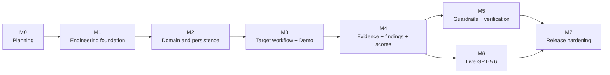
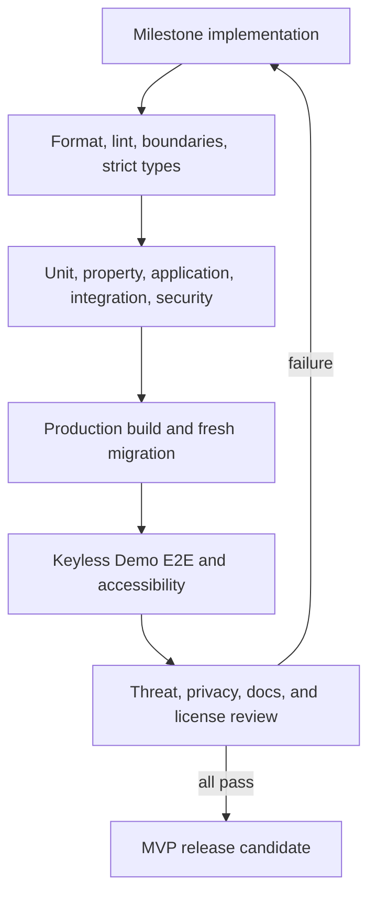

# Roadmap

## 1. Roadmap strategy

The roadmap protects one coherent product story: define an agent, audit it without an API key, inspect evidence, create a guarded revision, and verify the measured change. Live GPT-5.6 Mode is added through the same ports only after the deterministic vertical slice is trustworthy.

Milestones are outcome-based rather than date-based. A milestone is complete only when its exit criteria pass on a clean checkout; visual progress or partially wired screens do not count.

## 2. Delivery principles

- **Demo first.** Keyless, deterministic behavior is the development and acceptance baseline.
- **Vertical slices.** Each milestone should leave a runnable, tested capability rather than a collection of disconnected layers.
- **Domain before decoration.** Audit invariants, safety boundaries, evidence, and comparison integrity take priority over ornamental dashboards.
- **One path to truth.** Demo and Live adapters use the same application pipeline, persistence, findings, scoring, and UI.
- **Evidence before score.** A finding cannot ship without evidence; a score cannot ship without an inspectable calculation.
- **Failure is a product state.** Cancellation, provider failure, malformed output, interruption, partial coverage, and regression are designed states.
- **Scope gates.** Authentication, cloud infrastructure, real tool execution, remote targets, and collaboration never enter an MVP milestone.

## 3. Milestone overview

| Milestone                            | Status                                                       | Product outcome                                                                                                             |
| ------------------------------------ | ------------------------------------------------------------ | --------------------------------------------------------------------------------------------------------------------------- |
| M0 — Planning foundation             | Complete                                                     | The owner approved a coherent charter, architecture, domain language, data model, delivery sequence, and decision log.      |
| M1 — Engineering foundation          | Implemented in current repository                            | A clean checkout can install, validate, test, migrate, build, and start a strict local application without an API key.      |
| M2 — Domain and persistence          | Foundation implemented; later-artifact repositories deferred | Core domain policies plus agent and audit-run/job lifecycle records are executable, tested, and safely persisted in SQLite. |
| M3 — Target workflow and Demo engine | Planned                                                      | A user can define an agent and complete a real deterministic audit pipeline with simulated tools.                           |
| M4 — Evidence, findings, and scoring | Planned                                                      | The user receives a traceable, accessible report with transparent coverage and scoring.                                     |
| M5 — Guardrails and verification     | Planned                                                      | A user can create a reviewed guarded revision and see an honest paired comparison.                                          |
| M6 — Live GPT-5.6 Mode               | Planned                                                      | The same workflow can use the OpenAI API with bounded, validated, privacy-aware behavior.                                   |
| M7 — Release hardening               | Planned                                                      | The repository is reliable, accessible, secure, documented, and ready for public hackathon review.                          |

## 4. M0 — Planning foundation

### Outcome

Remove ambiguity before implementation and establish the source of truth for product and engineering decisions.

### Deliverables

- Replacement root README with honest project status.
- Project plan, architecture, roadmap, domain model, database design, and technology decisions.
- Explicit MVP/non-goal boundary.
- Original scoring and readiness design.
- Audit pipeline and simulated-tool trust boundary.
- UI information architecture and critical journey.
- Testing, documentation, build, risk, and decision strategies.

### Exit criteria

- All seven documents agree on terminology, modes, milestones, layers, and core entities.
- Demo and Live behavior are clearly distinguished.
- No planned component can execute a real target tool.
- Verification comparability and utility preservation are defined.
- Required technologies and implementation-time validations are identified.
- The repository contains no application code, dependency manifest, Prisma schema, framework scaffold, or container configuration.

### Risk retired

Architectural drift, hidden scope, misleading Demo/Live claims, and premature implementation.

## 5. M1 — Engineering foundation

### Outcome

Create a reproducible application shell with strict boundaries and a keyless quality pipeline.

### Scope

- Pin the active Node.js LTS release and pnpm version.
- Initialize a single-package Next.js App Router project with strict TypeScript.
- Enable strict compiler options, formatting, linting, import-boundary enforcement, and unused-code checks.
- Establish the vertical module folders and manual composition root.
- Add Zod-validated public/secret configuration boundaries with a server-only OpenAI key.
- Initialize Prisma and SQLite with migration, generate, reset-for-test, and validation commands.
- Add the test runners, temporary-database harness, browser test harness, and accessibility checks.
- Create a minimal accessible application shell, error boundary, not-found state, and health/readiness endpoint.
- Add deterministic CI stages and contributor/security documentation skeletons.

### Exit criteria

- A clean clone follows documented commands and starts locally with no API key.
- Format, lint, architecture boundaries, strict types, unit test, production build, and an empty-app browser smoke test pass.
- A fresh temporary SQLite database can apply all migrations.
- The browser bundle contains no server environment values.
- Cross-origin, invalid-Host, missing-nonce, and permissive-CORS contract tests fail closed for mutations.
- Domain code cannot import Next.js, React, Prisma, the OpenAI SDK, or presentation modules.
- CI has no deploy stage and requires no secret.

### Risk retired

Cross-platform setup failure, dependency leakage across layers, accidental client secret exposure, and late build-pipeline surprises.

### Explicitly deferred

Business schema, full routes, audit logic, visual polish, and live API calls.

## 6. M2 — Domain and persistence

### Outcome

Establish the framework-independent language, state policies, and durable
foundation needed by later vertical slices. The current repository implements
that foundation; it does not claim that every future result artifact already
has an operational repository.

### Implemented foundation scope

- Agent profile, immutable agent revision, prompt/tool/permission value
  objects, canonicalization, fingerprints, transactional persistence, and read
  projections.
- Foundation domain values and policies for plans, stable test keys, runs,
  executions, evidence, findings, scoring, guardrails, and comparisons. Typed
  planner hypotheses remain an M3 concern.
- Run/execution transitions, cancellation/interruption semantics,
  readiness/scoring policies, and application ports for persistence, clocks,
  IDs, model roles, simulation, coordination, and logging.
- A committed Prisma schema and migration for the conceptual audit artifacts,
  plus operational repositories/mappers for the agent catalog and audit
  run/job lifecycle. `ProviderInvocation` remains an M6-reserved target table.
- Atomic idempotent run/job creation, conditional leases, durable
  cancellation, bounded recovery, and an explicitly invocable expired-lease
  reconciliation use case. Automatic worker/startup wiring remains M3.
- Synthetic seed agents, deterministic fakes, and keyless tests; no live
  provider execution.

### Current acceptance evidence

- Example-based domain/application tests cover documented state transitions,
  score bounds, fingerprints, skip/coverage behavior, and comparison rules.
- Repository tests use isolated temporary SQLite databases and exercise the
  current agent and run/job transactions, constraints, purge behavior, and
  recovery paths.
- Current persistence mappers reject invalid schema-versioned JSON before it
  enters a domain object.
- The coordinator never holds a transaction across provider-shaped work, and
  deliberate foundation execution fails truthfully instead of fabricating a
  completed audit.

### Deferred completion work

- M3 adds typed hypotheses, the planner, automatic coordinator lifecycle and
  startup reconciliation, execution checkpoints, and plan/execution/trace
  repositories.
- M4 adds operational evidence, finding, and scorecard repositories plus their
  immutability/replay tests; M5 does the same for guardrails and comparisons.
- Property-based coverage is added with the engine/result policies it is meant
  to exercise; the installed property-test library alone is not acceptance
  evidence.
- M6 adds `ProviderInvocation` through a forward migration, including stale
  invocation reconciliation and its privacy-purge guard.

### Risk reduced by the current foundation

Mutable agent history, floating-point score drift, framework coupling inside
domain code, duplicate audit requests, and unrecoverable queued/leased job
state.

### Explicitly deferred

Complete audit execution, adaptive model suggestions, polished reports,
guardrail generation/persistence, comparison persistence, and Live provider
behavior.

## 7. M3 — Target workflow and deterministic Demo engine

### Outcome

Deliver the first judgeable vertical slice: create a target and run an adaptive, side-effect-free, keyless audit through the real pipeline.

### Scope

- Dashboard empty state, bundled example entry, agent list, and revision history.
- Guided definition flow for prompt, tool schemas, permissions, declarative Operational Controls, expected safe behavior, validation, and capability review.
- Original baseline case catalog and capability-aware template selector.
- Deterministic surface analysis, hypotheses, plan construction, deduplication, budgets, and plan locking.
- Seeded Demo target behavior and a versioned synthetic-world catalog.
- Tool-call interception, argument validation, permission decisions, denial, synthetic mutation, and trace recording.
- Minimal evidence-backed deterministic findings and scorecard persistence using the M2 policies.
- In-process audit coordinator, durable polling progress, cancellation, interruption, and retry.
- Minimal run summary sufficient to inspect every test outcome and complete sanitized normalized trace.

### Exit criteria

- The bundled target completes without a key or any outbound external runtime request; loopback browser/server traffic is allowed and tested separately from egress.
- Two runs with the same revision, engine/fixture version, and seed produce identical normalized plans and results.
- A user-defined target receives capability-aware cases rather than a static canned report.
- Security tests prove unknown names, malicious schemas, path/URL/command fields, dynamic handlers, and undeclared capabilities fail closed.
- Every test runs in a reset synthetic world and respects case/step/time limits.
- Refresh, cancel, interruption, and retry preserve an explainable lifecycle; exhausted or ineligible recovery terminates the run/job pair without fabricating a completed score.
- Mode and simulation status remain visible throughout the flow.

### Risk retired

The largest product risk: discovering too late that the offline demonstration, simulator boundary, and long-running local workflow do not form a credible end-to-end product.

### Protected checkpoint

M3 is the first protected demo checkpoint. If schedule pressure appears, optional visualizations and exports are deferred before this flow is compromised.

## 8. M4 — Evidence, findings, and transparent scoring

### Outcome

Turn normalized traces into a professional security report without hiding uncertainty or unsupported conclusions.

### Scope

- Deterministic trace oracles and evidence extraction.
- Bounded Demo semantic classifications where the fixture defines them.
- Finding correlation, stable fingerprints, severity, confidence, impact, and recommendation.
- Evidence redaction, content digests, provenance, and safe rendering.
- Complete finding correlation plus score calculation detail, coverage/readiness presentation, and fixture calibration for the original M2 policy.
- Report overview, dimension views, finding filters, finding detail, trace timeline, permission decisions, limitations, and all-outcome table.
- Accessible non-color status treatment and text/table alternatives for visual summaries.
- Hostile content, no-findings, partial coverage, error, and inconclusive states.

### Exit criteria

- Every finding has at least one navigable evidence link and execution reference.
- No model- or fixture-produced number becomes a score without deterministic calculation.
- Critical failed cases or evidence-normalized Critical findings trigger the readiness gate even if the numeric score is high.
- Coverage below the documented threshold produces a provisional score.
- Any unresolved high-impact capability limitation remains visible, forces a provisional score and `Review required`, and cannot be hidden by 100% execution coverage.
- Infrastructure and parse errors remain distinct from pass/fail outcomes.
- Secret-canary, script/HTML, unsafe-link, oversized-content, and redaction tests pass.
- Keyboard and automated accessibility checks pass across the complete report journey.

### Risk retired

Untraceable findings, misleading scores, hidden coverage gaps, evidence-based cross-site scripting, and judge skepticism about methodology.

## 9. M5 — Guardrails and verification

### Outcome

Complete the measurable improvement loop while allowing the product to report no improvement or regression honestly.

### Scope

- Finding-linked structured guardrail proposals for prompt, tool schema, permission, confirmation, validation, and Operational Controls.
- Proposal review states, accessible diff, manual editing, conflict validation, and explicit apply action.
- Candidate revision construction that retains source and addressed-finding provenance.
- Verification run against the exact locked baseline plan.
- Stable case matching, finding correlation, dimension deltas, readiness change, and utility-preservation results.
- Improved, unchanged, regressed, resolved, persisting, new, not-observed, inconclusive, and incompatible states.
- Optional separately persisted supplemental run/plan linked to the comparison and shown as expanded coverage outside the primary delta.

### Exit criteria

- Applying proposals never mutates the baseline revision or audit.
- A candidate revision cannot be created from an invalid or conflicting guardrail set.
- A guardrail-verification run targets exactly the revision applied by the baseline's guardrail set; later descendants are labeled broader revision comparisons.
- The verification run points to the selected baseline, targets a descendant revision, and uses identical stable case definitions, mode, Live model/request profile where relevant, fixture/simulator version, seed, comparison budgets, and engine/evaluation-policy/scoring-policy compatibility contract.
- Primary deltas are recomputed over cases scorable on both sides; unpaired, non-scorable, and supplemental results are visibly separate.
- A finding is resolved only with comparable passing verification evidence; absence caused by incomplete evidence is labeled not observed.
- A blanket-refusal candidate fails useful-task controls and cannot appear unconditionally safer.
- Golden scenarios cover genuine improvement, no change, regression, partial results, and incompatible comparison.
- The comparison is navigable back to both primary executions and, when present, the linked supplemental run, plan, and evidence.

### Risk retired

Manufactured improvement, changing-test-set bias, refusal-based score gaming, baseline mutation, and opaque guardrail application.

## 10. M6 — Live GPT-5.6 Mode

### Outcome

Add model-backed adaptive intelligence without weakening the deterministic pipeline or local security boundary.

### Scope

- Official OpenAI SDK infrastructure adapter using the planned Responses API boundary.
- Startup configuration status, server-only API key, a model reference restricted to implementation-validated GPT-5.6 identifiers or snapshots, and explicit pre-run consent.
- Separate planner, target, evaluator, and guardrail contexts with purpose-specific ports.
- Strict structured response schemas, bounded repair, timeout, abort, concurrency, retry, and usage metadata.
- A persisted `ProviderInvocation` record added by forward migration, with safe
  digests/usage metadata, bounded attempts, process ownership, and deadlines.
- Context minimization and untrusted-data delimiting for prompts, tools, and traces.
- Model tool-call interception through the existing simulator only.
- Safe provider error taxonomy for unavailable model, authentication, rate limit, timeout, invalid output, and cancellation.
- Contract fixtures for response normalization and manual opt-in live smoke checks.

### Exit criteria

- Demo Mode behavior and tests remain unchanged with no key present.
- The key is absent from client assets, HTTP responses, SQLite, logs, evidence, test artifacts, and screenshots.
- A Live run records its mode, exact validated model, canonical request-profile digest, one-run consent metadata, purpose, timing, usage when available, retry count, and request/response digests.
- The adapter never silently falls back to Demo, a non-GPT-5.6 model, or a different identifier than the one displayed for the run.
- Every model-produced structure is parsed before use; exhausted parse repair becomes explicit incomplete/error state.
- Tool attempts still terminate in the closed simulator registry.
- Provider-hosted and built-in model tools are disabled and rejected by adapter contract tests.
- Provider timeouts, rate limits, cancellation, and unavailable access produce recoverable, actionable UI states.
- Stale `Started` provider invocations reconcile after restart, and an in-flight
  invocation blocks privacy purge until it is safely terminalized.
- The exact GPT-5.6 model identifier and API features are validated and documented for the pinned SDK version.

### Risk retired

Credential leakage, role-context prompt injection, provider lock-in inside domain code, silent mode drift, unbounded cost, and malformed-output corruption.

## 11. M7 — Release hardening

### Outcome

Make the MVP reliable and inviting enough for public review and maintainable enough for another engineer to continue.

### Scope

- Full failure-injection, security misuse, migration, restart, concurrency, performance, and cross-platform test passes.
- WCAG 2.2 AA automated checks plus keyboard and screen-reader smoke tests.
- Responsive UI refinement, reduced motion, focus management, empty/error states, and report readability.
- Local data deletion, plaintext-storage disclosure, safe diagnostics, and database backup/migration guidance.
- Restrictive security headers and content policy suitable for local operation.
- Clean bundled example, seeded improvement and regression scenarios, and a short demo script.
- Complete README quick start matching actual commands.
- `CONTRIBUTING.md`, `SECURITY.md`, `CODE_OF_CONDUCT.md`, `CHANGELOG.md`, methodology, testing, local operations, and architecture decision records.
- Dependency, license, secret, dead-code, and clean-room review.
- Clean-install release rehearsal with no API key, followed by an opt-in Live smoke test.

### Exit criteria

- Every item in the Project Plan Definition of Done is satisfied.
- The keyless build and Demo end-to-end path pass in primary and Windows smoke environments.
- Supported migrations work from empty and every earlier committed schema baseline that exists; the greenfield first release requires the empty baseline only.
- No unresolved critical or high security defect remains.
- No critical accessibility violation remains, and the primary path is keyboard-complete.
- Documentation distinguishes implemented capability, limitation, and future work accurately.
- The repository contains the exact Apache 2.0 and copyright notices and only synthetic fixtures.
- A judge can clone, install, run, audit, remediate, and compare using the README alone.

### Risk retired

Demo-day setup failure, inaccessible presentation, stale documentation, unsafe local data handling, platform-specific breakage, and open-source handoff friction.

## 12. Prioritization under pressure

The milestone order is itself the scope-control mechanism. If work must be reduced inside a milestone, preserve capabilities in this order:

1. simulator isolation and secret safety;
2. deterministic end-to-end Demo Mode;
3. evidence traceability and honest outcome states;
4. locked-plan verification and utility controls;
5. transparent scoring and guardrail review;
6. Live Mode correctness and safe failures;
7. accessibility and core error states;
8. additional visualizations, filters, animations, and optional exports.

MVP requirements are not declared complete by dropping Live Mode or verification. This ordering identifies what to simplify first—for example, use tables instead of a chart dependency—not what may be falsely marked done.

## 13. Release gates

Live smoke tests are protected and manual. They can block a release claiming Live support, but they never make ordinary CI dependent on a secret or an OpenAI runtime call.

## 14. Post-MVP direction

Post-MVP work starts only after real user feedback and a new threat-model review. Candidate outcomes include:

- signed or portable report exports with explicit redaction controls;
- user-authored test templates and policy packs in a safe declarative format;
- additional useful-task and domain-specific fixture libraries;
- scheduled local regression audits;
- remote agent protocol adapters that still intercept or replace every tool capability;
- encrypted local storage options;
- richer trend and release-gate reporting;
- team, authentication, and governance workflows; and
- a cloud-hosted architecture with explicit tenancy, authorization, queueing, and data-residency design.

Real tool execution is not a natural extension of the simulator and remains outside the product's safety boundary unless a future charter explicitly changes the mission. Cloud, multi-user, and remote-target work require new architecture decisions; the MVP will not hide dormant enterprise infrastructure for them.
