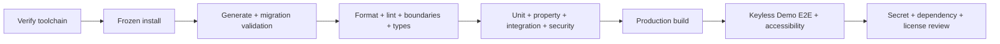

# Technology Decisions

## 1. Decision policy

This document records the technology and delivery decisions that shape Agent
Auditor. M1/M2 evidence is recorded as current implementation; later-milestone
decisions remain explicit targets. Decisions are classified as:

- **Implemented** — present in the current repository and backed by the cited
  configuration, code, or tests.
- **Accepted** — implementation must follow the decision unless an architecture
  decision record replaces it.
- **Validate at milestone** — direction is fixed, but a later integration or
  compatibility fact must be verified when that milestone begins.
- **Deferred** — intentionally outside the stated milestone; no operational
  placeholder should be presented as complete.

Each accepted decision favors the smallest architecture that preserves correctness, trust boundaries, testability, and a credible path to growth.

## 2. Stack summary

| Concern                | Decision                                                                                                                                           | Status                                   |
| ---------------------- | -------------------------------------------------------------------------------------------------------------------------------------------------- | ---------------------------------------- |
| Runtime                | Node.js 24.18.0, pinned in `.node-version` and constrained by `package.json`                                                                       | Implemented                              |
| Package manager        | pnpm 11.14.0 through Corepack with a committed immutable lockfile                                                                                  | Implemented                              |
| Application framework  | Next.js 16.2.10 and React 19.2.7 App Router in the Node.js runtime                                                                                 | Implemented                              |
| Language               | Strict TypeScript 6.0.3 with additional safety flags                                                                                               | Implemented                              |
| Architecture           | Single-package modular monolith, lightweight DDD, ports/adapters, light CQRS                                                                       | Implemented foundation                   |
| Validation             | Zod 4.4.3 at trust boundaries; domain constructors for semantic invariants                                                                         | Implemented foundation                   |
| Database               | Prisma 7.8.0 and SQLite with a committed forward migration                                                                                         | Implemented foundation                   |
| Live intelligence      | Official OpenAI JavaScript SDK behind a dormant server-only boundary; Responses API behavior and the allowed GPT-5.6 identifier set remain M6 work | Validate at M6                           |
| Offline intelligence   | Deterministic application-owned rules, templates, policies, and synthetic fixtures                                                                 | Foundation implemented; full engine M3   |
| Styling                | Tailwind CSS 4.3.3, semantic HTML, design tokens, and application-owned accessible components                                                      | Implemented foundation                   |
| Forms                  | React Hook Form 7.81.0 with Zod-derived form contracts                                                                                             | Implemented                              |
| Unit/integration tests | Vitest 4.1.10, Testing Library, and fast-check property tests; user-event is installed for later interaction suites                                | Implemented foundation                   |
| Browser tests          | Playwright 1.61.1 with Demo Mode and isolated temporary SQLite                                                                                     | Implemented smoke path                   |
| Accessibility          | axe-core component automation plus manual WCAG 2.2 AA release checks                                                                               | Foundation implemented; full journey M7  |
| Code quality           | ESLint 9, Prettier 3, TypeScript, and repository-owned source-scanning architecture tests                                                          | Implemented                              |
| Progress               | Persisted job state now; automatic worker lifecycle and resilient browser polling in M3                                                            | Foundation implemented                   |
| Logging                | Pino 10.3.1 structured local allow-list logs with redaction; no hosted telemetry                                                                   | Implemented                              |
| Evidence rendering     | Escaped plain text and owned text/code viewers; no model-supplied HTML or MVP Markdown renderer                                                    | Accepted                                 |
| Supply-chain checks    | Offline repository/secret guard, production-license allow-list, Gitleaks history scan, and OSV lockfile scan                                       | Implemented foundation; package audit M7 |
| CI runner              | GitHub-hosted `ubuntu-24.04` quality lane and `windows-2025` compatibility lane                                                                    | Implemented                              |
| Deployment             | Loopback local Node.js process only                                                                                                                | Implemented                              |

Exact dependency versions are pinned in `package.json` and `pnpm-lock.yaml`.
The table distinguishes installed foundations from later behavior; installing a
library alone does not claim that every planned suite or product path exists.

## 3. Architectural decisions

### TD-001 — Use a single-package modular monolith

**Status:** Accepted

**Context:** The MVP needs a browser UI, local server behavior, persistent long-running audits, and one database, but does not need independent scaling or cloud operations.

**Decision:** Build one deployable Node.js application and one package. Organize it into Agent Catalog, Auditing, and Remediation modules with explicit Domain, Application, Infrastructure, and Presentation layers.

**Why:** One process is simple for local users and hackathon evaluation. Compile-time boundaries, application ports, and explicit mappers provide maintainability without operational distribution.

**Consequences:**

- Cross-module calls are in-process and easy to test.
- A shared release version covers the entire application.
- The team must enforce imports mechanically so “monolith” does not become “unstructured.”
- Extracting a worker or database later remains possible through existing ports, but is not free.

**Rejected for MVP:** Separate frontend/API services, a monorepo, microservices, or dormant enterprise packages. They add coordination and failure modes without a current product boundary.

**Revisit when:** A separately scaled worker, a second independently released interface, or multiple teams with genuine ownership boundaries exist.

### TD-002 — Use lightweight DDD with ports and adapters

**Status:** Accepted

**Decision:** Domain code owns invariants, state transitions, scoring, and comparison. Application services own use-case orchestration and ports. Infrastructure implements those ports. Presentation translates routes, forms, and view models. Dependencies point inward.

**Why:** Audit correctness and comparison rules must remain testable without a web server, database, or model. Ports isolate the most volatile boundaries: persistence, OpenAI, Demo behavior, clocks, IDs, logging, job coordination, and simulation.

**Consequences:** Explicit mapping code is required. That cost is intentional: Prisma records, provider responses, and HTTP DTOs cannot silently become domain objects.

**Rejected for MVP:** A framework-centric “route calls ORM” design and a full enterprise DDD/event-sourcing framework.

### TD-003 — Use manual dependency injection

**Status:** Accepted

**Decision:** A server-only composition root creates repositories, adapters, policies, application services, and the local coordinator through factories. Request-scoped dependencies are explicit.

**Why:** The dependency graph is small enough to understand directly. Manual wiring keeps constructor contracts visible and avoids reflection, decorators, and service-location behavior.

**Consequences:** Bootstrap code requires deliberate maintenance and tests. Feature modules expose narrow construction functions rather than mutable singletons.

**Revisit when:** Object graph construction itself becomes a demonstrated maintenance problem.

### TD-004 — Use light CQRS, not event sourcing

**Status:** Accepted

**Decision:** Commands operate through domain aggregates and repositories. Queries use optimized read services that return serializable view models. SQLite rows are the source of truth; domain events are in-process notifications after transactions.

**Why:** Reports need joined projections, while commands need strict invariants. Separating these concerns prevents report requirements from bloating aggregates without creating two databases or an event-replay system.

**Consequences:** Query projections and command models can evolve separately. There is some duplicated shape, but not duplicated business truth.

**Rejected for MVP:** Event sourcing, an external event bus, and a transactional outbox. They solve distributed integration problems the MVP does not have.

## 4. Runtime and framework decisions

### TD-005 — Use Next.js App Router in the Node.js runtime

**Status:** Implemented in M1

**Decision:** Use Next.js for local server rendering, route composition, and HTTP route handlers. Server components are the default; client components are limited to forms, progress/cancellation, filtering, and genuinely interactive visualizations. Do not use an edge runtime.

**Why:** A single framework can deliver the professional UI and server boundary without maintaining a separate API service. The Node.js runtime supports Prisma, SQLite, local job coordination, and the official SDK.

**Consequences:**

- `src/app` is delivery code, not the application layer.
- Route handlers must call use cases rather than Prisma or provider adapters.
- Long-running work is detached into the persisted coordinator instead of relying on request lifetime.
- Framework upgrade behavior requires clean-build and restart-recovery tests.

**Rejected for MVP:** A client-only application, a separate API server, or server actions as an implicit business layer. Server actions may be used only as thin presentation adapters if their contracts remain explicit and testable.

### TD-006 — Use strict TypeScript throughout

**Status:** Accepted

**Decision:** Application code uses TypeScript with at least:

- `strict`;
- `noUncheckedIndexedAccess`;
- `exactOptionalPropertyTypes`;
- `noImplicitOverride`;
- `useUnknownInCatchVariables`;
- `noFallthroughCasesInSwitch`; and
- unused local/parameter checks consistent with framework-generated code.

`any` is forbidden in application code. External unknown values enter as `unknown` and are parsed. Exhaustive discriminated unions model states and results.

**Why:** Audit state and structured model output have many invalid combinations. Strong compiler settings catch accidental widening, missing cases, and unsafe indexed access before runtime.

**Consequences:** Provider and ORM mapping takes more care. Boundary adapters may contain narrowly documented type assertions only after runtime validation.

### TD-007 — Use pnpm and pin the toolchain

**Status:** Accepted; versions validate at M1

**Decision:** Use Corepack-managed pnpm, commit the lockfile, pin the Node.js and package-manager versions, and require frozen installs in CI.

**Why:** Deterministic installs, efficient local storage, strict dependency visibility, and straightforward single-package scripts.

**Consequences:** Contributor documentation must include the one-time runtime requirement. No workspace/monorepo configuration is added until more than one actual package exists.

## 5. Data and validation decisions

### TD-008 — Use Prisma with SQLite behind repositories

**Status:** Implemented foundation; future migrations repeat validation

**Decision:** SQLite is the local database and Prisma is the data-access/migration tool. Infrastructure repositories map records to domain objects. Core metadata is relational; heterogeneous payloads use canonical schema-versioned JSON text.

**Why:** SQLite requires no service installation and fits one trusted local process. Prisma provides typed access and an explicit migration history without making the domain dependent on storage.

**Consequences:**

- One writer and short transactions are design constraints.
- No transaction may span an OpenAI call.
- Generated Prisma types remain infrastructure-only.
- Database JSON is parsed on every read.
- Future database migration is possible but not promised to be automatic.

**Rejected for MVP:** An in-memory-only store, browser storage, a hosted database, or speculative multi-database support.

**M1/M2 evidence:** The committed migration and integration harness validate
canonical JSON text, foreign-key activation, migration checks, referential
actions, and transaction behavior. WAL remains an optional M3 benchmark;
correctness does not depend on native JSON operators or WAL.

### TD-009 — Use Zod at boundaries and domain policies for meaning

**Status:** Accepted

**Decision:** Zod parses environment, HTTP/form input, imports, tool schemas and calls, model output, database JSON, and structured guardrails. Strict schemas reject unknown fields unless a contract explicitly preserves them. Domain constructors then enforce semantic invariants.

**Why:** Runtime shape validation is essential when TypeScript types disappear at I/O boundaries. Domain policies still need to reject well-shaped but nonsensical combinations, such as a permission for an undeclared capability.

**Consequences:** Some rules intentionally appear at two different levels: a boundary schema rejects malformed shape; the domain rejects invalid meaning. Schemas are versioned and tested with accepted/rejected fixtures.

**Rejected for MVP:** Trusting generated ORM types, provider SDK types, or client validation as server validation.

### TD-010 — Use canonical JSON and integer calculations

**Status:** Accepted

**Decision:** Canonically serialize fingerprinted JSON with sorted keys and defined normalization. Use SHA-256 content digests. Persist scores in integer basis points and severity/outcome units as integers.

**Why:** Immutable revision/plan identity, stable Demo results, finding deduplication, and comparison require deterministic equality. Integer scoring avoids platform-dependent floating arithmetic.

**Consequences:** A canonicalization contract and fixtures become public versioned artifacts. A change to normalization creates a new schema/version rather than rewriting old fingerprints.

## 6. Audit intelligence decisions

### TD-011 — Provide explicit Demo and Live adapters

**Status:** Accepted; Live API details validate at M6

**Decision:** Every run stores one immutable `DEMO` or `LIVE` mode. Purpose-specific application ports have deterministic Demo implementations and optional OpenAI implementations. There is no silent fallback between modes.

**Why:** Demo Mode must be genuinely useful without a key, and provenance would be false if a failed Live run quietly returned deterministic fixtures. Shared ports ensure both modes exercise the same orchestration, evidence, scoring, remediation, and UI.

**Consequences:** Demo rules and fixtures are maintained as product behavior, not test-only mocks. The UI visibly labels simulation and external data transmission.

### TD-012 — Plan the OpenAI integration around the Responses API

**Status:** Server-only boundary implemented; API behavior validates at M6

**Decision:** Use the official OpenAI JavaScript SDK behind server-only infrastructure. The planned API boundary is the Responses API. The requested default model reference is `gpt-5.6`; configuration accepts only identifiers or snapshots verified to be GPT-5.6 during implementation.

**Why:** The application needs structured model output and tool-call-shaped behavior while retaining full control of tool handling. A single provider adapter limits SDK/API knowledge to infrastructure.

**Consequences:**

- The API key is an environment secret, never a browser setting or database field.
- Canonical non-secret planner/target/evaluator/guardrail request profiles and their digest are persisted with a Live run so comparisons can hold behavior-affecting settings constant and optional advice remains disclosed.
- The exact model identifier, availability, and supported request features must be verified before implementation is declared complete.
- Unavailable access is a configuration/provider error, not permission to change model, identifier, or mode.
- Model and API changes do not alter scoring or domain state transitions.

**Rejected for MVP:** Multiple provider support, model training/fine-tuning, provider calls from React, or raw SDK response persistence.

### TD-013 — Separate model roles and keep final decisions deterministic

**Status:** Accepted

**Decision:** Risk enrichment, test suggestions, target-under-test behavior, semantic evaluation, and guardrail advice use separate ports and instruction contexts. Target content is delimited as data in every auditor role. Deterministic policies own plan bounds, permission decisions, trace assertions where possible, severity normalization, state transitions, scores, readiness, and comparisons.

**Why:** A model evaluating content derived from another model can be injected, inconsistent, or overconfident. Role separation limits context contamination; deterministic ownership makes critical outcomes reproducible.

**Consequences:** More model calls may be required in Live Mode. Budgets and context minimization are therefore application-level requirements. Semantic ambiguity becomes inconclusive.

### TD-014 — Use a hybrid, staged audit engine

**Status:** Accepted

**Decision:** Implement the core audit as validation, surface analysis, hypotheses, plan, execution, trace evaluation, finding correlation, scoring, and finalization stages with persisted checkpoints. Model enrichment supplements deterministic rules and templates. Guardrail generation is an optional retryable post-completion command, and comparison is a separate deterministic workflow over two completed compatible runs.

**Why:** Stages are independently testable, observable, recoverable, and replaceable. A single “ask the model for an audit report” call would not provide evidence, fair replay, reliable scoring, or safe failures.

**Consequences:** The orchestration contains more modules and persisted state. Each core stage has a narrow input/output contract and cannot share unvalidated provider objects. Guardrail failure cannot invalidate a completed audit, and comparison never executes inside either source run.

### TD-015 — Make simulated tools a closed declarative catalog

**Status:** Accepted

**Decision:** All target tool calls pass through one interceptor. The simulator catalog is application-owned and maps allow-listed IDs to bounded synthetic state transitions and results. Users supply declarations and fixture selectors, never handlers, code, commands, paths, URLs, modules, or credentials. Provider-hosted and built-in model tools are never enabled; Live targets may emit only declared function-like attempts that are returned to the interceptor.

**Why:** “All tools are simulated” must be true by construction, not by a prompt instruction asking a model not to act.

**Consequences:** The supported tool-schema subset and simulator families are intentionally finite. Unsupported capabilities fail closed and appear as coverage limitations. An unresolved high-impact limitation makes the score provisional and forces review even if every planned case completed.

**Rejected for MVP:** Generic function registration, dynamic modules, shell/filesystem/browser/network adapters, or “dry-run” wrappers around real tools.

### TD-016 — Use an original deterministic score policy

**Status:** Accepted

**Decision:** Use the public severity/outcome formula in `DOMAIN_MODEL.md`. Security and utility are separate; missing evidence reduces coverage; readiness gates do not compensate Critical/High failures with other passes. A model never emits the final numeric score.

**Why:** The score must be explainable, stable, and clean-room. Evidence and coverage remain more important than one number.

**Consequences:** Changes to weights, dimensions, outcomes, coverage threshold, or readiness require a new policy version and compatibility handling. The product cannot tune scores simply to make a demonstration look better.

## 7. Job, API, and error decisions

### TD-017 — Use a persisted in-process job coordinator

**Status:** Accepted

**Decision:** A local coordinator leases SQLite job rows, runs one audit by default, checkpoints after phases/cases, and reconciles expired leases. It implements `AuditJobPort`; no external queue exists. Provider work occurs outside transactions.

**Current implementation:** M2 persists the run/job pair and implements
conditional leases, renewal, cancellation, bounded recovery, safe terminal
failure, and explicitly invocable reconciliation. The coordinator can be
called deliberately, but no automatic worker loop or startup/shutdown hook is
wired. M3 adds that process lifecycle and phase/case checkpoint orchestration.

**Why:** Audits can outlive an HTTP request and must survive page refresh. A local database lease provides recoverability without introducing infrastructure outside MVP scope.

**Consequences:** Process startup and shutdown behavior require integration and failure-injection tests. SQLite single-writer constraints cap concurrency. A separately scaled worker would require a later adapter and deployment decision.

### TD-018 — Use polling over persisted state for progress

**Status:** Accepted

**Decision:** The browser creates a run, receives an ID, and polls a typed run projection with increasing intervals. Commands cancel or retry idempotently. Persisted state, not an in-memory stream, is authoritative.

**Current implementation:** Audit creation returns an accepted persisted run.
The M1/M2 server-rendered page reads that state once per request and refreshes
after cancellation; it does not poll. Increasing-interval polling starts with
the M3 execution UI.

**Why:** Polling is robust across refresh, temporary disconnect, and process reconciliation. It is enough for phase/case progress and easier to validate than a long-lived stream.

**Consequences:** There is modest repeated local traffic. Response projections must be small and support ETag or version-based no-change responses if needed.

**Rejected for MVP:** WebSockets, mandatory server-sent events, or progress stored only in client memory. Streaming can be added later as an optimization over the same state.

### TD-019 — Use explicit versioned HTTP contracts

**Status:** Accepted

**Decision:** Local route handlers live under `/api/v1`, validate Zod request contracts, return serializable DTOs, and map known failures to a consistent problem-details envelope with stable application codes. Mutations are JSON-only and require validated loopback Host/Origin plus a per-process same-origin custom-header nonce; the server exposes no permissive CORS policy. Start/run/cancel/apply commands also accept idempotency keys where duplicate submission matters.

**Why:** Explicit contracts make presentation tests and future interfaces possible without leaking framework errors or domain internals. Host/origin/nonce checks protect a no-auth loopback server from malicious browser origins, cross-site requests, and DNS rebinding.

**Consequences:** Even same-repository UI and API changes must update contract tests. Stack traces, raw prompts, provider payloads, and secrets never appear in error responses.

## 8. UI decisions

### TD-020 — Use server-first React with small client islands

**Status:** Accepted

**Decision:** Server components render read-oriented pages. Client components handle multi-step forms, polling/cancel, filters, accessible dialogs/disclosures, and minimal charts. No global state library is selected initially; server data remains in route/query projections and local interaction state remains near the component.

**Current implementation:** Client islands cover validated agent creation,
queueing, and cancellation with explicit server refresh. Polling, report
filters, dialogs, and charts are later-milestone consumers of this decision,
not current foundation behavior.

**Why:** This reduces client JavaScript and prevents a second application state model. Audit truth already lives in SQLite and application queries.

**Consequences:** Mutations invalidate or refresh server projections explicitly. A client query library may be added only if polling/cache behavior becomes materially complex and is justified by an ADR.

### TD-021 — Use Tailwind CSS and application-owned accessible components

**Status:** Implemented foundation in M1

**Decision:** Define security-oriented visual tokens and compose semantic native HTML into small owned components. Use Tailwind for styling. Prefer native controls and progressively enhance them. Add a focused accessible primitive dependency only if a tested interaction cannot be delivered reliably with native elements, and record that addition.

**Why:** The UI needs a coherent original identity without a large component framework or copied product design. Owned components make states and accessibility behavior explicit.

**Consequences:** The project owns component QA. Component APIs must stay small, and complex custom controls are avoided when a native element works.

### TD-022 — Use React Hook Form for the target workflow

**Status:** Implemented foundation in M1

**Decision:** Use React Hook Form for prompt/tool/permission forms with Zod-derived client feedback. Submit canonical DTOs and reparse them on the server.

**Why:** Tool and permission editing is dynamic enough to benefit from structured field arrays and precise errors, while domain validation remains server-owned.

**Consequences:** Client and server error paths need mapping tests. Form state never becomes an aggregate or persistence model.

### TD-023 — Treat all displayed evidence as hostile text

**Status:** Accepted

**Decision:** Render MVP prompt and evidence content through escaped plain-text or owned code/text viewers; do not render model-supplied Markdown, HTML, or interactive links. Apply a restrictive content security policy. Use text/table alternatives for charts and accessible linear descriptions for diffs. Any later Markdown support requires a sanitizer and a new threat review.

**Why:** Agent and model output can intentionally contain markup, scripts, deceptive links, or layout-breaking text.

**Consequences:** Rich provider formatting may be discarded. Safety and evidence fidelity take precedence over rendering arbitrary HTML.

## 9. Observability, privacy, and configuration decisions

### TD-024 — Use structured local logs with allow-list fields

**Status:** Accepted

**Decision:** Log event name, severity, timestamp, correlation/run/test IDs, phase, duration, retry, and safe error code. Never log prompt bodies, tool arguments, evidence bodies, raw provider payloads, environment values, or keys. No hosted telemetry is enabled.

**Why:** Local diagnostics are necessary, but audit inputs can be sensitive and log pipelines often outlive the operation that produced them.

**Consequences:** Debugging content issues relies on user-visible sanitized evidence and explicit opt-in diagnostic export later, not verbose raw logs.

### TD-025 — Configure secrets only through the server environment

**Status:** Accepted

**Decision:** Planned configuration includes a server-only `OPENAI_API_KEY`, `OPENAI_MODEL` defaulting to the requested `gpt-5.6` and restricted to validated GPT-5.6 identifiers/snapshots, local `DATABASE_URL`, log level, and central audit budgets. Environment is parsed once. The browser receives only safe booleans and public limits.

**Why:** A local no-auth UI is not an appropriate secret-entry or secret-storage system.

**Consequences:** Live Mode setup requires restarting or reloading validated server configuration. The UI says whether Live Mode is configured but never displays or echoes the credential.

### TD-026 — No telemetry and explicit Live consent

**Status:** Accepted

**Decision:** Demo Mode makes no outbound external runtime request; browser-to-loopback HTTP remains local. Live Mode shows the exact model reference, classes of content to be transmitted, and retention caveat before start. The user explicitly confirms each Live audit request; consent state is recorded as safe metadata.

**Why:** Local-first must be meaningful, and prompts/tool schemas may be confidential.

**Consequences:** There is no automatic usage analytics. Product learning during the hackathon comes from voluntary feedback, not hidden collection.

## 10. Testing decisions

### TD-027 — Use a risk-based test pyramid

**Status:** Accepted

| Layer                        | Tools                                                  | Required coverage                                                                                                                                                                                                              |
| ---------------------------- | ------------------------------------------------------ | ------------------------------------------------------------------------------------------------------------------------------------------------------------------------------------------------------------------------------ |
| Domain                       | Vitest and fast-check                                  | Value objects, deterministic canonical serialization properties, invariants, transitions, score properties, typed coverage denominators, high-impact surface limitations, finding-resolution proof, fingerprinting, comparison |
| Application                  | Vitest with fakes                                      | Purpose-specific plan orchestration, idempotency, budgets, cancellation, bounded recovery exhaustion, supplemental linkage, retries, error mapping                                                                             |
| Persistence                  | Vitest with real temporary SQLite                      | Current agent/run/job migrations, constraints, mappers, atomic pairs, leases, purge, and recovery; result checkpoints and stale provider reconciliation arrive with their owning milestones                                    |
| Provider/simulator contracts | Vitest with synthetic fixtures                         | Valid/malformed output, tool attempts, denial, timeout, unavailable model, redaction                                                                                                                                           |
| Presentation/API             | Testing Library, user-event, axe, route contract tests | Forms, state variants, safe rendering, focus, keyboard, accessible names, Host/Origin/nonce/CORS enforcement                                                                                                                   |
| End to end                   | Playwright                                             | Complete keyless Demo, guardrails, verification, deletion, interruption                                                                                                                                                        |
| Manual release               | Browser and assistive-technology checks                | Live Mode smoke, keyboard, screen reader, reduced motion, cross-platform setup                                                                                                                                                 |

Broad visual snapshot testing is not the primary strategy. Golden artifacts are appropriate for deterministic Demo plans, traces, findings, and calculations; changes require intentional review.

The current `pnpm test:coverage` configuration enforces 75% global branch
coverage and 80% functions, lines, and statements when that command is run.
CI executes that coverage gate through `pnpm verify`. The release target remains
at least 90% branch coverage for critical domain/application modules and 80%
overall, with explicit per-module gates added before M7 acceptance. A
percentage never excuses an
untested trust boundary or state transition. Fast-check already exercises
deterministic canonical serialization properties. Installed user-event and
browser axe adapters remain reserved for the interaction and full-journey
suites that need them; installation alone is not counted as coverage.

### TD-028 — Keep automated CI keyless and deterministic

**Status:** Accepted

**Decision:** All ordinary validation uses Demo Mode, synthetic fixtures, a temporary SQLite database, no outbound external runtime call, and no API key. Live smoke tests are manual and protected. Dependency installation and supply-chain metadata checks are build-time concerns, not Demo runtime behavior.

**Why:** Model calls are nondeterministic, cost-bearing, access-dependent, and inappropriate as merge gates. The adapter remains covered by normalized contract fixtures.

**Consequences:** A release claiming Live Mode also requires a documented human smoke result, but pull requests remain reproducible for outside contributors.

## 11. Build pipeline decision

### TD-029 — Use a fail-fast, platform-neutral quality pipeline

**Status:** Accepted

The target release pipeline order is:

Current scripts established during M1 include:

- `format` and `format:check`;
- `lint` and `test:architecture` for repository-owned source-scanning boundary checks;
- `typecheck`;
- `db:generate`, `db:validate`, `db:migrate`, and isolated test-database commands;
- `test`, focused unit/application/integration/contract/architecture/security/accessibility scripts, and `test:coverage`;
- `test:e2e` and accessibility checks; and
- `build` and `start`.

The current GitHub Actions workflow performs the frozen install, offline
repository/secret and production-license guards, Prisma
generation/validation/migration, coverage-gated keyless quality sequence,
production build, and Demo browser smoke on `ubuntu-24.04`, with a lighter
`windows-2025` lane. A parallel keyless supply-chain job runs a
checksum-verified Gitleaks history scan and the pinned OSV Scanner action
against the lockfile. Package-manager audit and sanitized artifact upload
remain M7 work.

Pipeline rules:

- Install cannot modify the lockfile.
- Migrations run against a fresh temporary database and every earlier committed schema baseline that exists; v1 begins with the empty baseline.
- Production build has no OpenAI key.
- Browser tests start the production build, not only the development server.
- Any M7 failure/coverage artifact upload must sanitize content; databases,
  environment files, and prompts must never be uploaded. The current workflow
  uploads no artifacts.
- Superseded branch runs may be cancelled; the main branch repeats the full keyless suite.
- Use a primary environment plus a Windows smoke lane because local-first path and process behavior must be portable.
- There is no deploy stage.

## 12. Documentation and licensing decisions

### TD-030 — Keep durable decisions and behavior documented with the code

**Status:** Accepted

**Decision:** The root README is the entry point. The six planning documents are the baseline. Implementation adds focused ADRs, methodology, testing, local operations, API contracts, threat model, contribution guide, security policy, code of conduct, and changelog as the corresponding behavior appears.

**Why:** Documentation that precedes its behavior becomes misleading; documentation added after release becomes incomplete. Each milestone owns the documents for the capability it introduces.

**Consequences:** Changes to trust boundaries, persistence contracts, score policy, modes, or dependency direction require both an ADR and updates to affected reference documents.

### TD-031 — Use clean-room original content under Apache 2.0

**Status:** Accepted

**Decision:** Application code, audit taxonomy, test templates, score policy, prompts, fixtures, guardrails, and documentation will be original. Only appropriately licensed open-source dependencies are used. The repository retains the standard Apache License 2.0 text and displays `Copyright 2026 Jordi Garcia Castillón` in project notices.

**Why:** The project must be safe to publish, with original prompts, assessment logic, scoring, code, fixtures, and branding derived from this repository's requirements.

**Consequences:** Synthetic fixtures only. Dependency licenses are reviewed during M1 and release. Design provenance remains within this repository.

## 13. Decisions deliberately deferred

The following require new evidence and are not implemented as empty abstractions:

| Deferred topic                      | Trigger to revisit                                                     |
| ----------------------------------- | ---------------------------------------------------------------------- |
| Authentication and multi-tenancy    | A hosted or shared-user product charter                                |
| Cloud deployment and external queue | A requirement to run outside one trusted local process                 |
| Real or remote agent connectors     | A revised threat model and a protocol that preserves tool interception |
| Real tool execution                 | Explicit mission change; it is outside the current safety boundary     |
| Multiple model providers            | Demonstrated user requirement and provider-neutral contract review     |
| Plugin/rule-pack runtime            | A safe declarative extension format and supply-chain model             |
| Encrypted local database            | User demand and a cross-platform key-management design                 |
| Streaming progress                  | Polling fails measured UX/performance needs                            |
| Global client state/query framework | Local component/polling state becomes demonstrably complex             |
| Chart/component framework           | Native/owned accessible components fail a measured requirement         |
| Export formats                      | Core evidence/remediation/verification journey is complete             |

## 14. Implementation-time validation checklist

These checks do not reopen the architecture unless they fail materially:

1. **Completed in M1:** pin a mutually compatible runtime, framework, ORM,
   validation, SDK, styling, and test set in repository metadata and the
   immutable lockfile.
2. **M6:** confirm the exact GPT-5.6 identifier set, availability, Responses
   API request shape, structured-output behavior, tool-call representation,
   cancellation support, and usage metadata; reject non-GPT-5.6 identifiers for
   the named mode.
3. **Completed for the current schema:** verify Prisma SQLite canonical JSON,
   migration checks, referential actions, transactions, and generated-client
   behavior through the committed migration and integration tests. Repeat for
   every future migration.
4. **M3:** verify that the Next.js Node lifecycle starts and stops the
   in-process coordinator exactly once in development, test, and production.
5. **M3/M7:** benchmark polling, SQLite job leases, optional WAL, trace batch
   size, and the initial 15-second Demo target.
6. **M6:** run the secret-in-client-bundle test before any Live UI is added.
7. **Ongoing/M7:** expand native-component checks to the complete journey and
   finish manual keyboard/screen-reader validation before release.
8. **Completed in M1:** use pinned GitHub-hosted `ubuntu-24.04` and
   `windows-2025` runners. Record supported versions and clean-install evidence
   in release documentation.

If a validation fails, record the evidence and choose the narrowest replacement that preserves the domain, trust boundaries, and public behavior.
