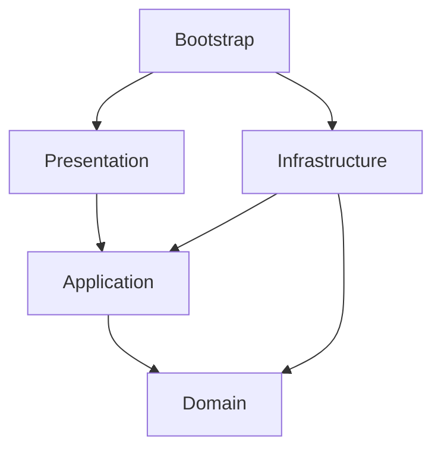

# ADR 0001: Local-First Modular Monolith

- **Status:** Accepted
- **Date:** 2026-07-18
- **Decision scope:** Application structure and dependency direction

## Context

Agent Auditor needs a production-quality local MVP with a web interface,
versioned domain logic, SQLite persistence, a persisted background-job
foundation, deterministic Demo behavior, and an optional provider boundary. It
does not need distributed deployment, independent scaling, multi-tenancy, or
multiple release units.

A framework-centric layout would make domain policy difficult to test and would
encourage React route handlers or Prisma records to become the business model.
A microservice or monorepo architecture would add deployment, coordination, and
versioning costs without a current product requirement.

## Decision

Build one strict TypeScript application package as a local-first modular
monolith. Use Next.js App Router as the delivery framework and divide business
ownership into Agent Catalog, Auditing, and Remediation bounded contexts.

Each module uses four lightweight layers:

- **Domain:** framework-independent entities, value objects, policies, and state
  transitions.
- **Application:** use cases, orchestration, repository/provider/job ports, and
  serializable DTOs.
- **Infrastructure:** Prisma repositories, persisted jobs, configuration,
  logging, providers, clocks, and identifiers.
- **Presentation:** application-owned React components and HTTP translation.

`src/bootstrap` is the manual composition root. It constructs concrete adapters
and passes them to application services; no dependency-injection container or
global service locator is used.

Modules expose intentional public APIs through their `index.ts` files where
cross-module collaboration is needed. A module must not deep-import another
module's infrastructure or aggregate internals.

## Dependency rules

- Domain cannot import Next.js, React, Prisma, Zod boundary schemas, the OpenAI
  SDK, HTTP types, environment access, or presentation code.
- Application cannot import concrete repositories, provider SDKs, or React.
- Presentation cannot call Prisma or contain domain decisions.
- Infrastructure translates external records into domain/application contracts
  through explicit mappers.
- `src/app` remains a thin route and layout delivery layer.

Critical rules are enforced by architecture tests and path aliases. An
exception requires evidence and an ADR rather than an ignored lint violation.

## Consequences

### Positive

- One install, process, database, build, and release unit keep local setup small.
- Framework-independent policies are fast to test and reusable from routes,
  jobs, tests, or a future interface.
- Provider, persistence, clock, ID, and job implementations remain replaceable
  through narrow ports.
- Context ownership and public module APIs reduce accidental coupling.

### Costs and limitations

- The repository must actively enforce boundaries that a physical service split
  would otherwise make obvious.
- The single process shares failure and resource limits.
- Cross-module changes still ship together.
- A future hosted/multi-process architecture will require a new decision and
  adapters, not merely a deployment configuration change.

## Alternatives considered

- **Framework-first Next.js folders:** rejected because business policy would be
  coupled to route/component lifecycles and difficult to test independently.
- **Microservices:** rejected because there is no independent scaling or
  deployment requirement and the operational cost conflicts with local-first
  scope.
- **Monorepo/workspace:** rejected because there is one application package and
  no demonstrated independently versioned library.
- **Dependency-injection framework:** rejected because manual factories are
  sufficient and make construction explicit.

## Revisit when

Revisit only when the product requires an independently deployed worker,
multi-user hosted service, or separately versioned client/library. Preserve the
domain and application contracts during any physical split.
