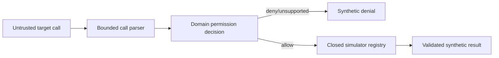

# ADR 0002: Closed, Declarative Tool Simulation

- **Status:** Accepted
- **Date:** 2026-07-18
- **Decision scope:** Target execution and side-effect boundary

## Context

Agent definitions contain untrusted prompts, tool schemas, permissions, and
future model-produced call attempts. Allowing a user definition to register a
handler, endpoint, path, module, command, or credential would turn an audit into
an arbitrary execution system. A prompt-level instruction to avoid side effects
would not enforce the security property.

The product charter requires every target tool to be simulated and forbids real
external tools. This must be true by construction in application code.

## Decision

Represent tools as validated declarations only. Every future target call passes
through one application-owned interceptor, a deterministic permission policy,
and a closed simulator catalog.

The catalog maps an allow-listed `simulatorId` to bounded synthetic state and
results implemented by the application. Users can select supported declarative
capabilities and synthetic fixture parameters; they cannot provide executable
behavior.

The accepted JSON Schema subset is finite and intentionally excludes remote or
recursive references and custom executable extensions. Tool/permission policy
rejects:

- code, commands, scripts, and handlers;
- file or module paths;
- arbitrary URLs, endpoints, and network clients;
- dynamic imports or evaluation;
- browser automation and provider-hosted built-in tools; and
- undeclared tools, capabilities, or scopes.

Unsupported capabilities fail closed and later appear as explicit coverage
limitations. A Live target may eventually emit only declared function-like
attempts, which return to the same local interceptor. It cannot enable a
provider-hosted tool.

The engineering foundation implements declarations, validation, ports, and
forbidden-import tests. The complete target execution loop and simulator
families are deferred; the foundation does not claim an execution result.

## Enforcement boundary

Architecture/security tests fail if protected simulator or target-execution
paths import process execution, VM, worker, filesystem, socket, TLS, arbitrary
HTTP, browser, or dynamic-module capabilities. Normal build, migration, and
test tooling may use operating-system facilities outside this protected
boundary.

## Consequences

### Positive

- The no-real-side-effects property does not depend on model compliance.
- Demo behavior can be deterministic, bounded, and reproducible.
- Tool attempts and permission decisions can become reviewable evidence.
- Unsupported inputs have an explicit failure/coverage meaning.

### Costs and limitations

- The application supports only simulator families it owns and reviews.
- Declarations for a novel capability may be stored but cannot be executed
  until a safe synthetic simulator is added.
- This product cannot be used as a generic agent integration runner.
- Real remote-agent or real-tool support would violate the current charter and
  cannot be introduced behind a feature flag.

## Alternatives considered

- **User-supplied handlers or plugins:** rejected as arbitrary code execution and
  a supply-chain boundary.
- **Dry-run wrappers around real SDKs:** rejected because implementation bugs or
  misconfiguration could still cause a side effect.
- **Prompt-only tool prohibition:** rejected because instructions are not a
  security boundary.
- **Containers/sandboxes around real tools:** rejected because destructive real
  integration is outside product scope, not merely insufficiently isolated.

## Revisit when

Any proposal for real endpoints, remote agents, plugins, or target-controlled
execution requires a mission change, separate threat model, and new ADR. It
cannot weaken this closed Demo simulation path.
