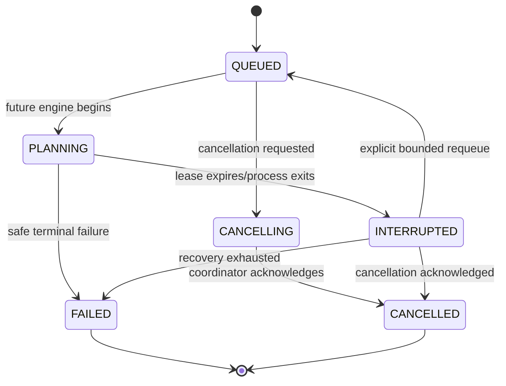

# ADR 0003: SQLite-Backed Persisted Local Jobs

- **Status:** Accepted
- **Date:** 2026-07-18
- **Decision scope:** Audit request lifecycle and local coordination

## Context

An audit can outlive one HTTP request and future provider work must not hold a
database transaction open. Page refreshes and process interruption must not
erase requested work or produce a false completion. At the same time, the MVP
is local-first and explicitly excludes Redis, an external queue, Kubernetes,
and distributed worker infrastructure.

In-memory promises or a framework background callback would lose authoritative
state at restart. A full external job system would add operations and failure
modes that the local product does not need.

## Decision

Persist an `AuditRun` and `AuditJob` atomically in the same SQLite database used
by the application. A local coordinator implements `AuditJobPort` and acquires
eligible jobs through conditional, time-bounded leases.

The current M1/M2 foundation provides:

- atomic audit-run and queued-job creation;
- required idempotency keys for every audit-creation request;
- coordinator leasing primitives with bounded configurable concurrency, but no
  automatically started worker loop;
- lease owner/token, acquisition time, expiry, heartbeat/version metadata, and
  conditional acquisition;
- durable cancellation requests, including immediate queued cancellation;
  active phase/case boundary checks arrive with M3 execution;
- short transactions for leasing and checkpoints, never spanning provider work;
- an explicitly invocable reconciliation use case for expired active work to
  `INTERRUPTED` and a safe job recovery/terminal state; automatic startup
  invocation arrives with the M3 worker lifecycle; and
- explicit safe failure metadata without prompt, evidence, or stack content.

Reconciliation does not silently restart an audit. A separate bounded recovery
policy may later create a new attempt when eligible. It never append-writes into
an interrupted execution attempt.

Audit-run status uses the approved coarse lifecycle (`QUEUED`, `PLANNING`,
`EXECUTING`, `EVALUATING`, `FINALIZING`) plus cancellation, interruption, and
failure states. Fine-grained work such as surface analysis, correlation, or
scoring is represented by `currentPhase`, not incompatible duplicate statuses.

In this engineering phase, the complete audit engine is absent. The coordinator
must keep work visibly queued/pending or fail with an explicit safe
not-implemented engine error if deliberately invoked. It never creates a
scorecard, finding, evidence-backed pass, or `COMPLETED` result.

The current server-rendered run page reads persisted state once per request and
refreshes after cancellation. M3 adds increasing-interval polling over the same
authoritative projection; no in-memory event becomes a source of truth.

## Lifecycle sketch

Later phases can traverse execution/evaluation/finalization only through the
domain transition policy and persisted checkpoints.

## Consequences

### Positive

- Refresh and restart do not erase the audit request.
- Refresh already preserves authoritative state; M3 polling reads the same
  persisted projection instead of an in-memory event.
- Conditional leases and idempotency make duplicate work testable.
- No external runtime service is required for local setup or CI.
- `AuditJobPort` preserves a future adapter boundary.

### Costs and limitations

- SQLite's single-writer behavior limits useful concurrency.
- Process lifecycle hooks and lease timing require integration/failure tests.
- When M3 wires the worker lifecycle, the local process must close database
  handles and stop acquisition safely.
- A separately scaled worker requires a new adapter, process identity, and
  deployment decision.

## Alternatives considered

- **Request-bound execution:** rejected because audits can exceed request
  lifetimes and browser refresh must not affect truth.
- **In-memory queue:** rejected because restart loses lifecycle and
  cancellation state.
- **Redis/external queue:** rejected as unnecessary infrastructure for a single
  local process.
- **Database transaction around an entire audit:** rejected because future
  provider latency would create long locks and unsafe recovery.

## Revisit when

Revisit after measured SQLite contention or a requirement for independently
deployed workers. Preserve run/job idempotency, checkpoint, cancellation, and
interruption semantics in any replacement.
