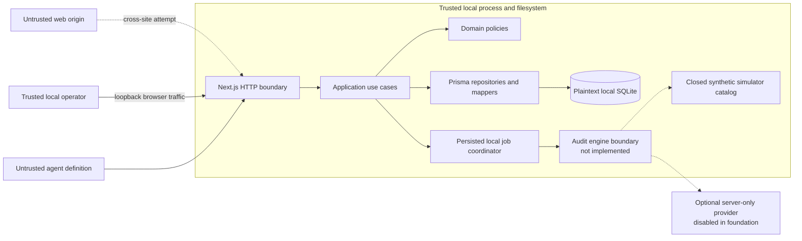
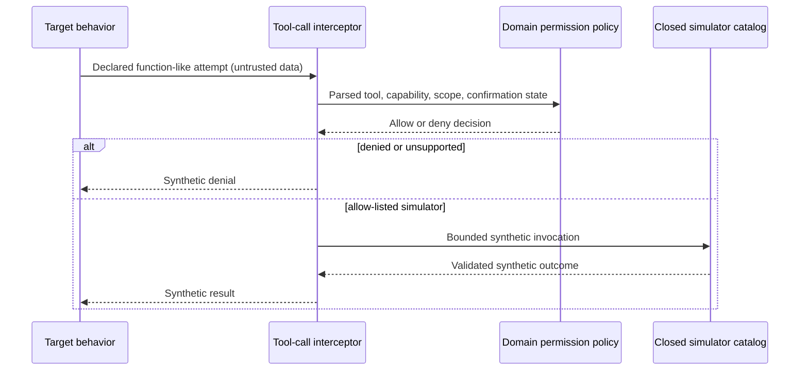

# Threat Model

## 1. Purpose and current scope

This threat model covers the local-first Agent Auditor engineering foundation:
the browser/server boundary, versioned agent definitions, SQLite persistence,
persisted job lifecycle, deterministic Demo/fake providers, logging, and the
closed tool-simulation contract.

The complete audit engine is not implemented in this phase. No target tool is
executed, and no finding, score, or security result is produced. The controls
below define and test the boundary that later engine work must preserve.

This document is not a claim that the application or an audited agent is
secure. It records assets, assumptions, threats, controls, and residual risk so
changes can be reviewed explicitly.

## 2. Security objectives

1. **No real target side effects.** Target-controlled input cannot reach a
   shell, filesystem, browser, arbitrary network, dynamic module, or executable
   handler.
2. **Secret containment.** Server credentials do not enter browser payloads,
   SQLite, logs, error responses, evidence, screenshots, or test artifacts.
3. **Integrity of provenance.** Agent revisions and completed audit artifacts
   are immutable, validated, versioned, and linked to deterministic content
   digests.
4. **Truthful lifecycle.** Infrastructure errors, interrupted work, missing
   coverage, and unimplemented phases cannot be represented as a security pass
   or completed audit.
5. **Untrusted-content containment.** Agent definitions, tool schemas, persisted
   JSON, provider-shaped data, and future evidence are parsed, bounded, and
   rendered as hostile text.
6. **Keyless reproducibility.** Demo development, tests, builds, and CI require
   no API key or outbound provider call.

## 3. System and trust boundaries

### Trust classification

| Zone                                      | Trust level                                    | Treatment                                                                          |
| ----------------------------------------- | ---------------------------------------------- | ---------------------------------------------------------------------------------- |
| Application source and pinned build       | Trusted computing base                         | Reviewed changes, frozen lockfile, architecture/security tests                     |
| Local browser                             | Partially trusted                              | No secrets; every request is revalidated by the server                             |
| Agent prompt, schemas, permissions, notes | Untrusted                                      | Size/depth/shape/domain validation; stored as sensitive local content              |
| Future target/provider output             | Untrusted                                      | Purpose-specific schemas, budgets, escaped display, deterministic policy ownership |
| SQLite data                               | Untrusted on read for shape; sensitive at rest | Explicit mappers and schema-version validation; plaintext disclosure               |
| Environment                               | Trusted only after server validation           | Parsed once; secret fields omitted from public projection                          |
| Demo/fake provider                        | Trusted application infrastructure             | Deterministic synthetic contracts; no external runtime request                     |
| Optional provider                         | External processor                             | Server-only, explicit configuration/consent, bounded calls; currently dormant      |

## 4. Assets

- system prompts, expected behavior notes, tool schemas, and permissions;
- future transcripts, evidence, findings, and remediation proposals;
- optional provider API credentials and authorization metadata;
- audit and revision provenance, fingerprints, version identifiers, and state;
- integrity of job leasing, cancellation, recovery, and idempotency;
- local application/database availability;
- source, dependency lockfile, migration history, and release artifacts; and
- user trust in labels that distinguish queued, incomplete, simulated, failed,
  and completed work.

## 5. Actors and assumptions

### Actors

- **Local operator:** controls the machine and intentionally uses the
  application. The MVP trusts this user but still protects them from malicious
  content rendered in their browser.
- **Malicious content author:** supplies a prompt, schema, tool declaration, or
  future model output intended to escape validation or trigger a side effect.
- **Malicious web origin:** attempts to command a loopback service from the
  operator's browser or exploit DNS rebinding/CORS behavior.
- **Compromised dependency or build input:** attempts to alter execution or
  exfiltrate data during installation/build/runtime.
- **External provider:** a future optional processor that may fail, change
  behavior, or receive disclosed content in Live Mode.

### Assumptions

- The local operating system, Node.js runtime, repository checkout, and user
  account are not already compromised.
- The application binds to loopback and is used by one trusted local operator.
- The database directory inherits appropriate local filesystem permissions.
- Dependencies can access the network while being installed; normal Demo
  runtime does not need outbound provider access.
- Users do not deliberately place genuine credentials in agent definitions.

Binding the server beyond loopback, adding authentication/multi-user access,
adding real tools, accepting remote agents, or adding arbitrary plugins changes
these assumptions and requires a new architecture decision and threat review.

## 6. Threats and controls

| Threat                                   | Example attack                                                                                              | Foundation controls                                                                                                                                              | Verification                                                                                             |
| ---------------------------------------- | ----------------------------------------------------------------------------------------------------------- | ---------------------------------------------------------------------------------------------------------------------------------------------------------------- | -------------------------------------------------------------------------------------------------------- |
| Cross-site loopback mutation             | A malicious page posts a new agent or audit to `localhost`                                                  | Loopback host policy, validated `Host` and `Origin`, JSON-only mutations, same-origin nonce, no permissive CORS, idempotency for duplicate-sensitive commands    | API contract/security tests for cross-origin, invalid host, absent nonce, content type, and CORS headers |
| Stored or reflected script injection     | A prompt contains `<script>`, event handlers, deceptive links, or layout-breaking markup                    | React escaping, text/code viewers, no raw HTML or model-supplied Markdown, restrictive CSP, safe URL policy                                                      | Hostile rendering, raw-HTML, URL, CSP, and axe-compatible tests                                          |
| Arbitrary tool execution                 | A schema contains a handler, command, path, URL, or module reference                                        | Explicit safe schema subset, executable-metadata rejection, normalized allow-listed simulator ID, no generic executor                                            | Domain/security tests plus forbidden-import architecture scan                                            |
| Filesystem/network/shell escape          | Target-controlled values reach `fs`, HTTP, sockets, child processes, VM, workers, or dynamic import         | Closed simulation boundary; forbidden modules in simulator/target execution; no target-controlled URL/path/module                                                | Architecture tests scan protected paths for forbidden imports and dynamic execution                      |
| Prototype pollution or parser confusion  | Input includes `__proto__`, constructors, excessive nesting, unsupported schema features, or ambiguous JSON | Zod/boundary parsing, own-property-safe canonicalization, schema keyword allow list, depth/count/byte limits, domain policy                                      | Malicious-shaped JSON, schema-depth/size, and unsupported-keyword tests                                  |
| Secret exposure in browser               | Server environment or key enters config JSON or a client bundle                                             | Server-only configuration module, allow-listed public projection, no `NEXT_PUBLIC_` secrets                                                                      | Config endpoint and client-bundle canary tests                                                           |
| Secret exposure in logs/errors           | Token appears in request metadata, stack, raw provider body, prompt, or tool arguments                      | Allow-listed structured events, common-secret redaction, safe error codes/messages, production stack suppression                                                 | Secret-canary, authorization/password/private-key, and production error tests                            |
| Persistence shape injection              | Local or legacy database contains malformed JSON that bypasses domain rules                                 | Schema versions, explicit persistence mappers, read-time and write-time validation                                                                               | Real SQLite mapper rejection tests                                                                       |
| Mutable history                          | A revision, completed artifact, or provenance row is overwritten                                            | Append-only repository methods, uniqueness/foreign keys, immutable domain semantics, controlled new-revision use case                                            | Domain and Prisma integration tests                                                                      |
| Digest misconception or collision misuse | A digest is presented as authenticity proof                                                                 | SHA-256 over canonical content only; documentation calls it a fingerprint, not a signature                                                                       | Determinism/change tests and documentation review                                                        |
| Audit-state fabrication                  | A crashed or absent engine marks a run completed/passed                                                     | Explicit transition policy, persisted phase/job state, unimplemented engine never emits findings/scores/completion, infrastructure errors separate from outcomes | Transition, foundation-coordinator, and absence-of-results tests                                         |
| Duplicate/racing work                    | Repeated requests create multiple jobs or two workers lease one job                                         | Idempotency key, atomic run/job creation, lease token/deadline, conditional acquisition, bounded concurrency                                                     | Application/integration concurrency tests                                                                |
| Unsafe restart or cancellation           | A process dies mid-run or cancellation is lost                                                              | Durable cancellation request, expired-lease reconciliation to interrupted state, no silent restart, short transactions                                           | Fixed-clock reconciliation and cancellation tests                                                        |
| Resource exhaustion                      | Huge prompt/schema or excessive cases/duration consume memory/CPU/database                                  | Body-size, prompt/tool/permission/schema bounds; maximum cases, steps, duration, timeout, and concurrency                                                        | Oversized input and budget tests                                                                         |
| Prompt injection into auditor roles      | Target text instructs planner/evaluator to ignore policy                                                    | Target content treated as delimited data, purpose-specific ports/contexts, structured output validation, deterministic policy ownership                          | Synthetic injection fixtures and normalized provider contract tests in later engine milestones           |
| Optional provider leakage                | Live sends more content than disclosed or logs request bodies                                               | Live disabled in the foundation; server-only key boundary; future one-run consent bound to revision/model/transmission digest; minimized payload; no raw logging | Missing-config tests now; manual consent and live smoke only after Live milestone                        |
| Supply-chain compromise                  | Lockfile drift or malicious dependency changes build/runtime behavior                                       | Exact versions, frozen pnpm install, minimal dependencies, read-only CI permissions, dependency/license review                                                   | Clean-checkout CI and release checklist                                                                  |

## 7. Closed simulation invariant

All future target tool attempts must follow one route:

There is no branch from the interceptor to a real endpoint, operating-system
capability, user-provided handler, or provider-hosted built-in tool. A new real
tool adapter cannot be introduced as an implementation detail; it is outside
the charter.

## 8. Data handling and privacy

- Demo Mode keeps application runtime data local. Browser-to-loopback traffic
  remains on the machine.
- SQLite is not application-encrypted. Revision text is stored verbatim for
  fidelity and may contain sensitive information despite secret warnings.
- Logs contain operational identifiers, durations, safe phase/error metadata,
  and correlation IDs only. Prompts, evidence bodies, raw arguments, and raw
  provider payloads are excluded.
- No hosted telemetry is enabled.
- Redaction detects common patterns and sensitive field names but cannot
  recognize every possible secret. Users must not rely on it as the primary
  protection for credentials.
- Live Mode is unconfigured/disabled in this foundation. Later Live work must
  disclose content classes, model reference, and provider retention caveats and
  obtain explicit one-run consent before transmission.
- Deletion removes relational records according to documented referential
  actions. SQLite page reuse means row deletion does not guarantee immediate
  physical byte removal from the file or backups.

## 9. Residual risk

- A process or user with access to the local account can read or modify the
  plaintext database and environment.
- Content fingerprints reveal change and support reproducibility but do not
  authenticate the database or author.
- Validation and redaction reduce common mistakes but cannot identify every
  malicious construct or secret encoding.
- Loopback services still depend on correct Host/Origin/nonce implementation and
  the local browser/network stack.
- Dependency installation is a supply-chain and network boundary outside Demo
  runtime; pinning does not eliminate compromised upstream packages.
- Bounded local input can still consume resources within accepted limits.
- A future model can be inconsistent, unavailable, or adversarially influenced;
  deterministic policies and inconclusive outcomes reduce but do not remove
  that risk.
- The engineering foundation does not yet assess agents, so it provides no
  security coverage or assurance about a supplied definition.

## 10. Security test requirements

Changes are not complete without direct tests for affected trust boundaries.
The minimum maintained suite covers:

- secret redaction and safe public configuration;
- hostile HTML/script and unsafe URL handling;
- oversized and prototype-pollution-shaped input;
- unsupported JSON Schema and executable tool metadata;
- production error envelopes without raw stacks;
- domain/environment/framework import isolation;
- forbidden execution imports under simulator/target boundaries;
- immutable persistence and JSON mapper validation;
- lease exclusivity, interruption reconciliation, cancellation, and idempotency;
  and
- absence of fabricated security artifacts from the foundation coordinator.

Report suspected boundary failures privately using [SECURITY.md](../../SECURITY.md).
Update this document and the relevant ADR whenever a trust boundary, asset,
actor, external processor, or execution capability changes.
